# 一站式智能电商平台 — 系统设计说明书

> **项目名称**：One-Stop Smart Shopping Platform  
> **文档版本**：v1.0  
> **编写日期**：2026-03-18  
> **技术栈**：Spring Boot 3.3.4 + MyBatis-Plus + Vue 3 + TypeScript

---

## 目录

1. [系统体系架构](#1-系统体系架构)
2. [系统功能结构](#2-系统功能结构)
3. [系统用例时序图](#3-系统用例时序图)
4. [复杂功能算法设计](#4-复杂功能算法设计)
5. [面向对象类图详细设计](#5-面向对象类图详细设计)
6. [接口设计](#6-接口设计)
7. [数据库物理设计](#7-数据库物理设计)
8. [UI界面设计](#8-ui界面设计)

---

## 1 系统体系架构

### 1.1 总体架构图

本系统采用**前后端分离**的 B/S 架构，前端基于 Vue 3 + TypeScript，
后端基于 Spring Boot 3，通过 RESTful API 进行通信。

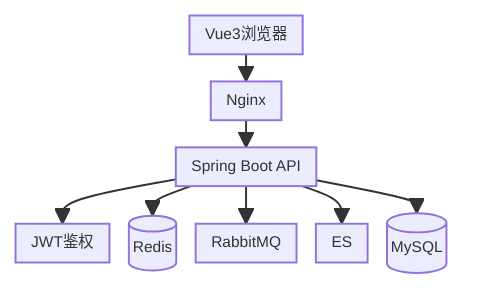

### 1.2 技术选型一览

| 层级 | 技术 | 用途 |
|------|------|------|
| 前端框架 | Vue 3 + TypeScript | SPA 单页应用 |
| 构建工具 | Vite 5 | 开发热更新与打包 |
| UI 组件库 | Element Plus | 表单/表格/弹窗等 |
| 状态管理 | Pinia | 用户状态/购物车 |
| 路由 | Vue Router 4 | 前端路由与权限守卫 |
| 后端框架 | Spring Boot 3.3.4 | Web 服务容器 |
| ORM | MyBatis-Plus 3.5 | 数据库访问 |
| 认证授权 | Spring Security + JWT | 无状态身份认证 |
| 缓存 | Redis + Caffeine | 多级缓存策略 |
| 消息队列 | RabbitMQ | 订单超时/推荐事件 |
| 搜索引擎 | Elasticsearch | 商品全文检索 |
| 数据库 | MySQL 8 | 关系型数据存储 |
| 分布式锁 | Redisson | 库存扣减并发控制 |
| API 文档 | Knife4j (OpenAPI3) | 接口文档自动生成 |

### 1.3 后端分层架构

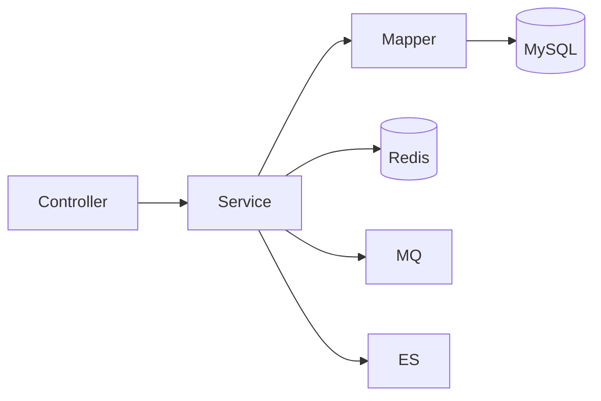

各层职责：

| 层 | 职责 |
|----|------|
| Controller | 接收 HTTP 请求，参数校验，调用 Service |
| Service | 业务逻辑处理，事务管理 |
| Mapper | MyBatis-Plus 数据访问接口 |
| Entity | 数据库表映射实体 |
| DTO | 请求数据传输对象 |
| VO | 响应视图对象 |

### 1.4 前端分层架构

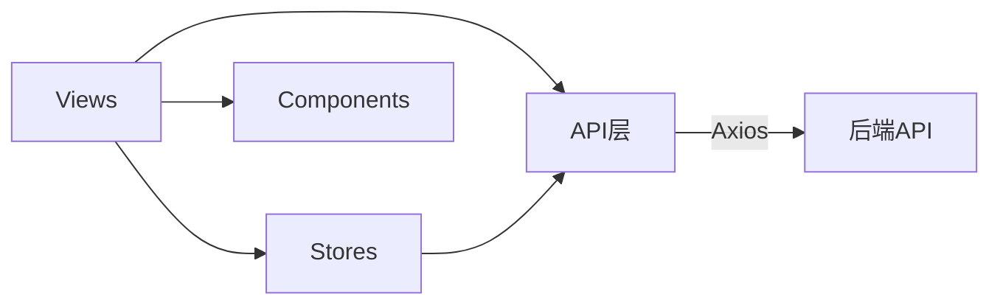

前端目录结构：

| 目录 | 说明 |
|------|------|
| `views/` | 页面组件（按角色分目录） |
| `api/` | 后端接口封装（16 个模块） |
| `stores/` | Pinia 状态管理 |
| `components/` | 通用 UI 组件 |
| `composables/` | 可复用组合式函数 |
| `layout/` | 布局组件（4 种角色布局） |
| `router/` | 路由定义与导航守卫 |
| `types/` | TypeScript 类型定义 |
| `utils/` | 工具函数 |
| `constants/` | 枚举常量 |

---

## 2 系统功能结构

### 2.1 一级功能模块

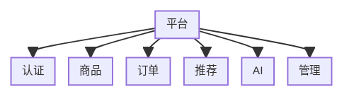

### 2.2 功能层次分解

#### 认证授权模块

| 二级功能 | 三级功能 |
|----------|----------|
| 用户注册 | 账号注册、角色分配 |
| 用户登录 | JWT 签发、Token 刷新 |
| 个人中心 | 信息修改、密码修改 |
| 权限控制 | RBAC 角色校验、接口鉴权 |

#### 商品管理模块

| 二级功能 | 三级功能 |
|----------|----------|
| 商品浏览 | 列表搜索、详情查看、分类筛选 |
| 商品发布 | SPU/SKU 创建、图片上传 |
| 商品维护 | 上架/下架、编辑、删除 |
| 分类管理 | 树形分类、增删改查 |
| 商品搜索 | ES 全文检索、多条件过滤 |

#### 订单交易模块

| 二级功能 | 三级功能 |
|----------|----------|
| 购物车 | 添加、修改数量、删除、选中 |
| 收货地址 | 新增、编辑、删除、设默认 |
| 下单 | 提交订单、库存锁定 |
| 支付 | 模拟支付、支付记录 |
| 订单管理 | 查看、取消、确认收货 |
| 商家发货 | 发货操作、物流详情 |
| 退款 | 申请退款、商家审批 |
| 订单超时 | RabbitMQ 延迟队列自动取消 |

#### 智能推荐模块

| 二级功能 | 三级功能 |
|----------|----------|
| 热门商品 | 时间衰减评分、定时刷新 |
| 个性化推荐 | 兴趣画像、协同过滤、热门填充 |
| 相似商品 | 多属性匹配、共购分析 |
| 用户画像 | 浏览/收藏/购买/评价信号聚合 |
| 结果重排 | 多样性约束、新鲜度加权 |

#### AI 能力模块

| 二级功能 | 三级功能 |
|----------|----------|
| 商品问答 | RAG 知识库检索 |
| 评价摘要 | AI 生成评价总结 |
| 智能文案 | 标题/描述/卖点生成 |
| 购物计划 | 创建计划、定时提醒、执行 |
| 智能代理 | Agent 任务、加购推荐 |

#### 平台管理模块

| 二级功能 | 三级功能 |
|----------|----------|
| 仪表盘 | 平台统计数据总览 |
| 商家审核 | 申请列表、审批操作 |
| 商品审核 | 待审商品、通过/驳回 |
| 分类管理 | 管理员分类增删改 |

---

## 3 系统用例时序图

### 3.1 用户注册与登录

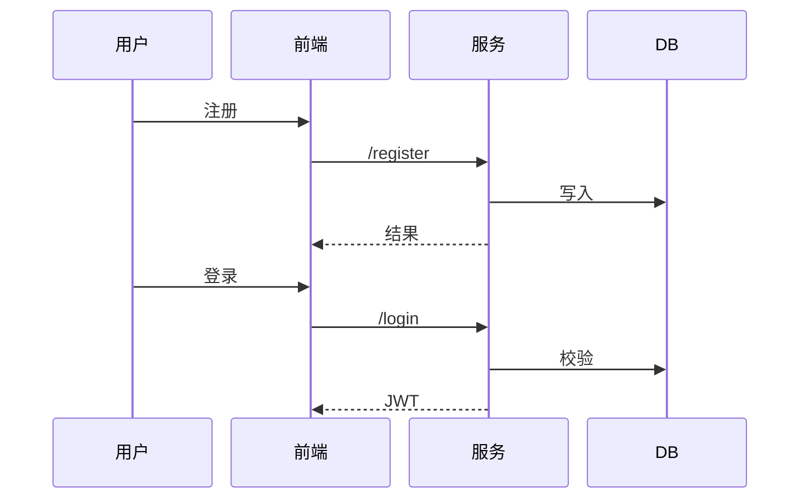

**说明**：注册时先校验用户名唯一性，密码使用 BCrypt 加密存储。
登录成功后返回 JWT Token，前端将其存入 localStorage，
后续每次请求在 Authorization 头部携带 `Bearer <token>`。

### 3.2 商品搜索与浏览

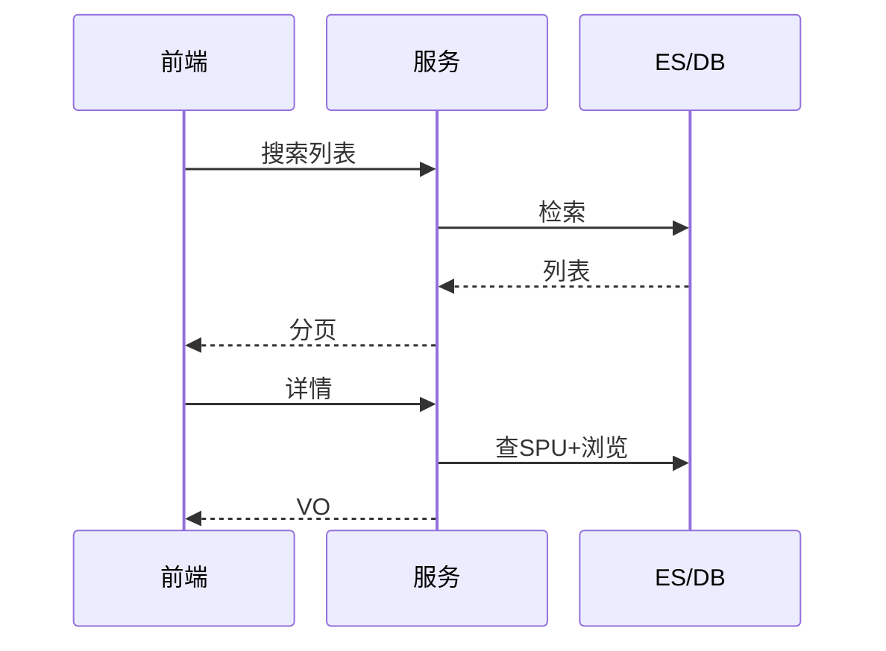

**说明**：搜索优先使用 Elasticsearch 全文检索，
ES 不可用时降级为 MySQL LIKE 查询。
访问商品详情时同步更新浏览量并记录用户浏览历史，
用于后续推荐系统的兴趣画像构建。

### 3.3 下单与支付流程

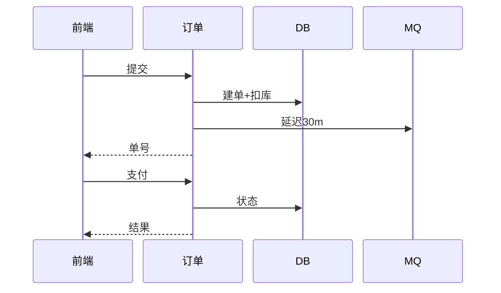

**说明**：下单时使用乐观锁（version 字段）控制库存并发扣减。
下单成功后发送 RabbitMQ 延迟消息，30 分钟未支付则自动取消。
支付采用模拟方式，更新订单状态为待发货。

### 3.4 推荐系统流程

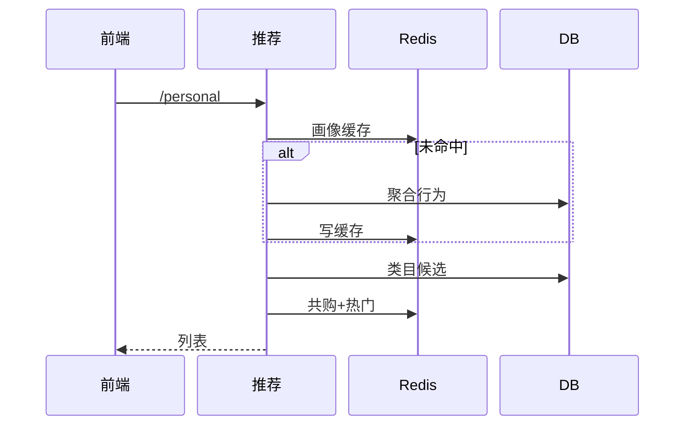

**说明**：个性化推荐融合三路策略——兴趣画像（权重时间衰减）、
协同过滤（共购矩阵）、热门填充。结果经过重排序保证类目多样性
（每类最多 3 个）和新品加权，排除已购商品。

### 3.5 订单超时自动取消

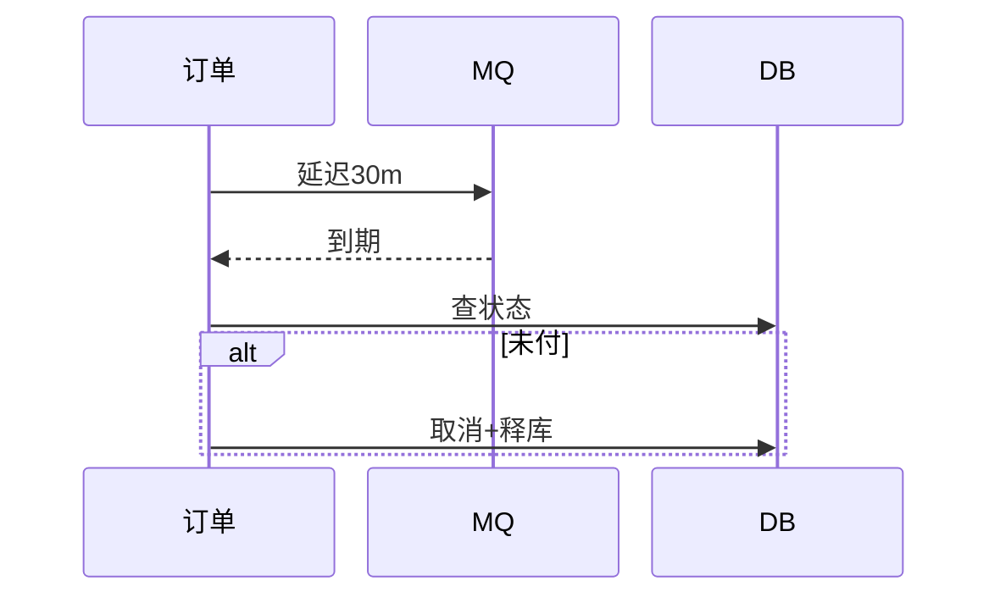

**说明**：利用 RabbitMQ 死信队列（DLX）实现延迟消息。
订单创建时发送 30 分钟延迟消息，到期后消费者检查订单状态，
若仍为未支付则自动取消并释放库存。

---

## 4 复杂功能算法设计

### 4.1 热门商品评分算法

热门商品评分综合考虑用户互动、近期销量、评价质量和时间衰减。

**算法流程图：**

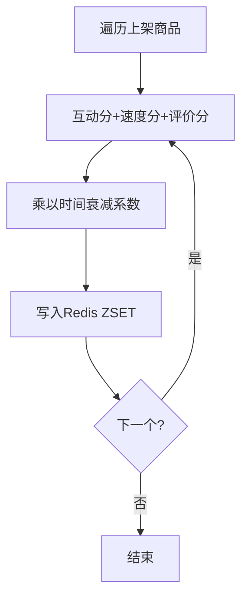

**伪码表示：**

```
FUNCTION refreshHotProducts():
    products ← 查询所有上架且审核通过的商品
    DELETE Redis key "hot:products"

    FOR EACH spu IN products:
        // 1. 互动分
        engagement = browse×1 + like×2 + fav×3 + sales×5

        // 2. 近 7 天销量速度分
        recentSales = COUNT(order_item WHERE spu_id=spu.id
                           AND create_time > NOW()-7days)
        velocity = recentSales × 10

        // 3. 评价质量加成（平均分 ≥ 4.0 才加成）
        avgScore = AVG(review.score WHERE spu_id=spu.id)
        reviewBonus = IF avgScore >= 4.0
                      THEN sales × 2.0 ELSE 0

        // 4. 时间衰减（基于商品创建日期）
        days = DAYS_BETWEEN(spu.createTime, NOW)
        decay = MAX(e^(-0.005 × days), 0.1)

        // 5. 最终评分
        finalScore = (engagement + velocity + reviewBonus) × decay
        ZADD "hot:products" finalScore spu.id

    LOG("刷新完成，共 " + products.size + " 件商品")
```

### 4.2 用户兴趣画像构建算法

用户兴趣画像从四种行为信号聚合而成，每种信号有不同权重和
时间衰减半衰期。

**信号权重表：**

| 行为类型 | 权重 | 半衰期（天） |
|----------|------|-------------|
| 浏览 | 1.0 | 7 |
| 收藏 | 5.0 | 30 |
| 购买 | 10.0 | 60 |
| 好评（≥4分） | 8.0 | — |
| 差评（≤2分） | -5.0 | — |

**伪码表示：**

```
FUNCTION buildProfile(userId):
    profile = { categoryScores: {}, brandScores: {},
                interactedIds: Set, purchasedIds: Set }

    // 1. 浏览信号（近 30 天，最多 200 条）
    FOR EACH browse IN 近30天浏览记录:
        days = DAYS_SINCE(browse.time)
        decay = e^(-ln2/7 × days)
        addSignal(browse.spuId, 1.0 × decay, profile)

    // 2. 收藏信号
    FOR EACH fav IN 用户全部收藏:
        decay = e^(-ln2/30 × DAYS_SINCE(fav.time))
        addSignal(fav.spuId, 5.0 × decay, profile)

    // 3. 购买信号
    FOR EACH order IN 用户已付款订单:
        FOR EACH item IN order.items:
            decay = e^(-ln2/60 × DAYS_SINCE(order.time))
            addSignal(item.spuId, 10.0 × decay, profile)
            profile.purchasedIds.add(item.spuId)

    // 4. 评价信号
    FOR EACH review IN 用户全部评价:
        weight = IF score>=4 THEN 8.0
                 ELSE IF score<=2 THEN -5.0
                 ELSE 0
        addSignal(review.spuId, weight, profile)

    RETURN profile

FUNCTION addSignal(spuId, weight, profile):
    spu = 查询商品(spuId)
    profile.categoryScores[spu.categoryId] += weight
    profile.brandScores[spu.brandName] += weight
    profile.interactedIds.add(spuId)
```

### 4.3 库存乐观锁扣减算法

```
FUNCTION deductStock(skuId, quantity, orderNo):
    FOR retry = 1 TO 3:
        sku = SELECT * FROM product_sku WHERE id = skuId
        IF sku.stock < quantity:
            THROW "库存不足"

        affected = UPDATE product_sku
                   SET stock = stock - quantity,
                       lock_stock = lock_stock + quantity,
                       version = version + 1
                   WHERE id = skuId
                     AND version = sku.version

        IF affected > 0:
            记录库存变更日志(skuId, orderNo, -quantity)
            RETURN  // 扣减成功
        ELSE:
            CONTINUE  // 版本冲突，重试

    THROW "库存操作失败，请重试"
```

### 4.4 共购矩阵构建算法

```
FUNCTION rebuildCoPurchaseMatrix():
    items ← SELECT order_no, spu_id FROM order_item
    orderMap ← GROUP items BY order_no

    coPurchase = {}  // spu_a → { spu_b → count }
    FOR EACH (orderNo, spuIds) IN orderMap:
        distinct = UNIQUE(spuIds)
        IF distinct.size < 2: CONTINUE
        FOR EACH pair (a, b) IN distinct × distinct WHERE a≠b:
            coPurchase[a][b] += 1

    // 写入 Redis
    FOR EACH (spuId, related) IN coPurchase:
        key = "copurchase:" + spuId
        DELETE key
        FOR EACH (relatedId, count) IN related:
            ZADD key count relatedId
        EXPIRE key 12h
```

---

## 5 面向对象类图详细设计

### 5.1 公共基础类

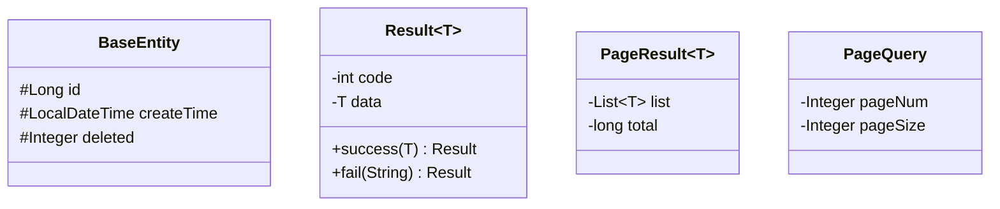

### 5.2 用户与认证模块

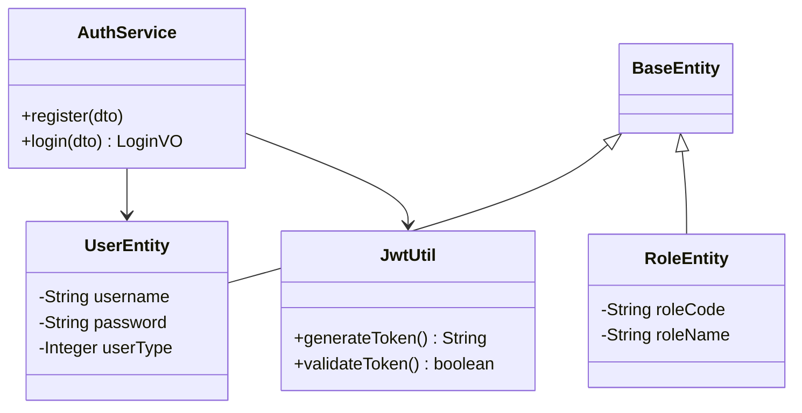

### 5.3 商品模块

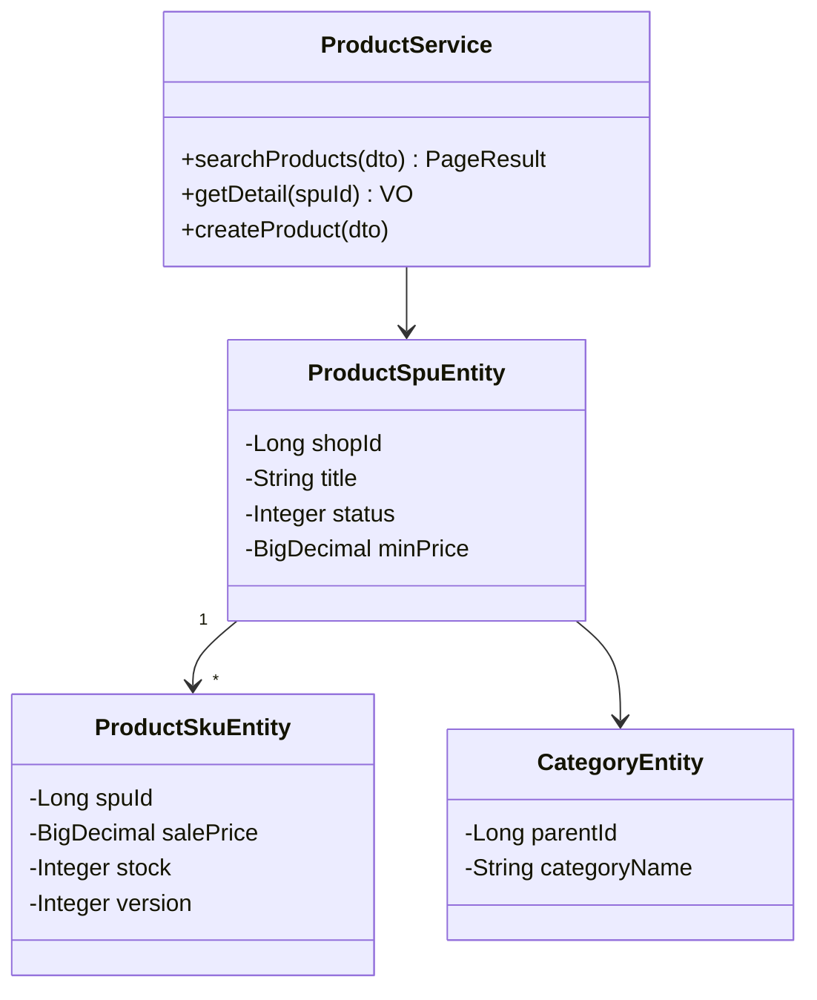

### 5.4 订单模块

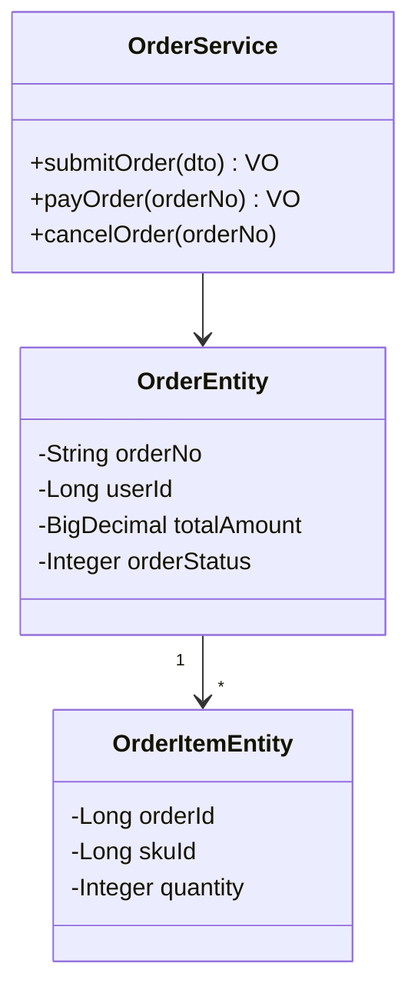

### 5.5 推荐系统模块

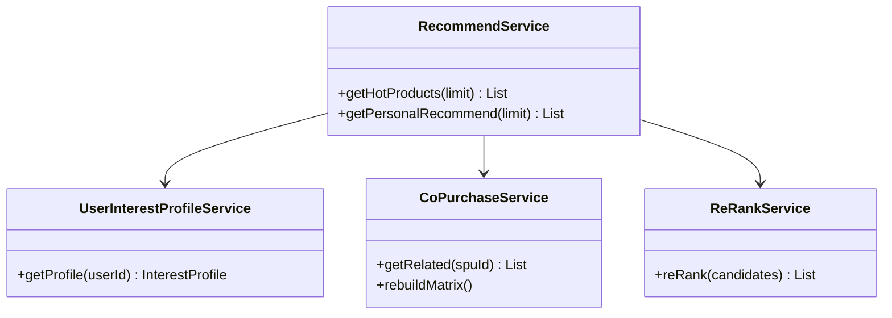

---

## 6 接口设计

### 6.1 统一响应格式

所有接口统一返回 `Result<T>` 结构：

```json
{
  "code": 200,
  "message": "success",
  "data": { ... }
}
```

分页接口返回 `Result<PageResult<T>>`：

```json
{
  "code": 200,
  "message": "success",
  "data": {
    "list": [ ... ],
    "total": 100,
    "pageNum": 1,
    "pageSize": 10
  }
}
```

### 6.2 认证模块接口

| 方法 | 路径 | 说明 | 权限 |
|------|------|------|------|
| POST | `/api/auth/register` | 用户注册 | 公开 |
| POST | `/api/auth/login` | 用户登录 | 公开 |

### 6.3 用户模块接口

| 方法 | 路径 | 说明 | 权限 |
|------|------|------|------|
| GET | `/api/user/me` | 获取当前用户信息 | 登录 |
| PUT | `/api/user/profile` | 更新个人资料 | 登录 |
| PUT | `/api/user/password` | 修改密码 | 登录 |

### 6.4 商品模块接口

| 方法 | 路径 | 说明 | 权限 |
|------|------|------|------|
| GET | `/api/products` | 搜索商品列表 | 公开 |
| GET | `/api/products/{spuId}` | 商品详情 | 公开 |
| POST | `/api/products` | 创建商品 | 商家 |
| PUT | `/api/products/{spuId}` | 编辑商品 | 商家 |
| PUT | `/api/products/{spuId}/on-shelf` | 上架 | 商家 |
| PUT | `/api/products/{spuId}/off-shelf` | 下架 | 商家 |
| GET | `/api/products/my` | 我的商品 | 商家 |
| DELETE | `/api/products/{spuId}` | 删除商品 | 商家 |
| GET | `/api/categories` | 分类树 | 公开 |
| POST | `/api/categories` | 创建分类 | 管理员 |

### 6.5 购物车模块接口

| 方法 | 路径 | 说明 | 权限 |
|------|------|------|------|
| POST | `/api/cart/add` | 添加到购物车 | 登录 |
| GET | `/api/cart/list` | 获取购物车 | 登录 |
| PUT | `/api/cart/update` | 更新数量/选中 | 登录 |
| DELETE | `/api/cart/item/{skuId}` | 删除购物车项 | 登录 |

### 6.6 地址模块接口

| 方法 | 路径 | 说明 | 权限 |
|------|------|------|------|
| POST | `/api/address` | 新增地址 | 登录 |
| GET | `/api/address/list` | 地址列表 | 登录 |
| PUT | `/api/address` | 编辑地址 | 登录 |
| DELETE | `/api/address/{id}` | 删除地址 | 登录 |

### 6.7 订单模块接口

| 方法 | 路径 | 说明 | 权限 |
|------|------|------|------|
| POST | `/api/order/submit` | 提交订单 | 登录 |
| GET | `/api/order/{orderNo}` | 订单详情 | 登录 |
| GET | `/api/order/list` | 我的订单 | 登录 |
| POST | `/api/order/{no}/cancel` | 取消订单 | 登录 |
| POST | `/api/order/{no}/pay` | 支付订单 | 登录 |
| POST | `/api/order/{no}/confirm-receive` | 确认收货 | 登录 |
| POST | `/api/order/{no}/deliver` | 发货 | 商家 |
| GET | `/api/order/merchant/list` | 商家订单 | 商家 |
| POST | `/api/order/{no}/refund/apply` | 申请退款 | 登录 |
| POST | `/api/order/{no}/refund/approve` | 审批退款 | 商家 |
| POST | `/api/order/{no}/refund/reject` | 拒绝退款 | 商家 |
| GET | `/api/order/{no}/delivery` | 物流详情 | 登录 |

### 6.8 评价模块接口

| 方法 | 路径 | 说明 | 权限 |
|------|------|------|------|
| POST | `/api/review` | 提交评价 | 登录 |
| GET | `/api/review/product/{spuId}` | 商品评价列表 | 公开 |
| GET | `/api/review/product/{spuId}/statistics` | 评价统计 | 公开 |
| POST | `/api/review/{id}/reply` | 商家回复 | 商家 |

### 6.9 商家模块接口

| 方法 | 路径 | 说明 | 权限 |
|------|------|------|------|
| POST | `/api/merchant/apply` | 申请入驻 | 登录 |
| GET | `/api/merchant/shop/current` | 我的店铺 | 商家 |
| PUT | `/api/merchant/shop` | 编辑店铺 | 商家 |
| GET | `/api/merchant/shop/statistics` | 店铺统计 | 商家 |
| GET | `/api/merchant/apply/list` | 申请列表 | 管理员 |
| POST | `/api/merchant/apply/{id}/audit` | 审核申请 | 管理员 |

### 6.10 推荐模块接口

| 方法 | 路径 | 说明 | 权限 |
|------|------|------|------|
| GET | `/api/recommend/hot` | 热门商品 | 公开 |
| GET | `/api/recommend/similar/{spuId}` | 相似商品 | 公开 |
| GET | `/api/recommend/personal` | 个性化推荐 | 登录 |

### 6.11 收藏与行为接口

| 方法 | 路径 | 说明 | 权限 |
|------|------|------|------|
| POST | `/api/favorite/toggle` | 收藏/取消收藏 | 登录 |
| GET | `/api/favorite/list` | 收藏列表 | 登录 |
| GET | `/api/favorite/check/{spuId}` | 是否已收藏 | 登录 |
| GET | `/api/behavior/history` | 浏览历史 | 登录 |
| DELETE | `/api/behavior/history` | 清空浏览历史 | 登录 |

### 6.12 管理员接口

| 方法 | 路径 | 说明 | 权限 |
|------|------|------|------|
| GET | `/api/admin/dashboard` | 仪表盘数据 | 管理员 |
| POST | `/api/admin/product/{spuId}/approve` | 审核通过 | 管理员 |
| POST | `/api/admin/product/{spuId}/reject` | 审核驳回 | 管理员 |

### 6.13 AI 与智能接口

| 方法 | 路径 | 说明 | 权限 |
|------|------|------|------|
| POST | `/api/rag/ask` | RAG 商品问答 | 登录 |
| GET | `/api/rag/session/{id}/history` | 聊天历史 | 登录 |
| POST | `/api/rag/knowledge/import/{spuId}` | 导入知识库 | 商家 |
| GET | `/api/ai/review-summary/{spuId}` | 评价摘要 | 公开 |
| POST | `/api/ai/copywriting/title/{spuId}` | 生成标题 | 商家 |
| POST | `/api/ai/copywriting/description` | 生成描述 | 商家 |
| POST | `/api/ai/copywriting/selling-points/{spuId}` | 卖点 | 商家 |
| POST | `/api/agent/task` | 创建 Agent 任务 | 登录 |
| GET | `/api/agent/task/{taskId}` | 任务结果 | 登录 |
| POST | `/api/agent/task/{id}/add-to-cart` | 加购推荐 | 登录 |
| POST | `/api/plan` | 创建购物计划 | 登录 |
| GET | `/api/plan/list` | 计划列表 | 登录 |
| GET | `/api/plan/{planId}` | 计划详情 | 登录 |
| POST | `/api/plan/{planId}/cancel` | 取消计划 | 登录 |
| POST | `/api/plan/{planId}/execute` | 执行计划 | 登录 |

---

## 7 数据库物理设计

### 7.1 数据库总览

- **数据库**：MySQL 8，字符集 `utf8mb4`
- **存储引擎**：InnoDB（支持事务、行锁、外键）
- **ID 策略**：雪花算法 (`ASSIGN_ID`) / 自增
- **逻辑删除**：`deleted` 字段 (0/1)
- **乐观锁**：`version` 字段（库存表）

共 **22** 张数据表，按模块分组如下。

### 7.2 用户与权限表

#### sys_user（用户表）

| 字段 | 类型 | 约束 | 说明 |
|------|------|------|------|
| id | BIGINT | PK, AUTO_INCREMENT | 主键 |
| username | VARCHAR(64) | NOT NULL, UNIQUE | 用户名 |
| password | VARCHAR(255) | NOT NULL | BCrypt 加密密码 |
| nickname | VARCHAR(64) | | 昵称 |
| phone | VARCHAR(20) | UNIQUE | 手机号 |
| email | VARCHAR(128) | | 邮箱 |
| avatar_url | VARCHAR(255) | | 头像 URL |
| status | TINYINT | DEFAULT 1 | 0禁用 1启用 |
| user_type | TINYINT | DEFAULT 1 | 1买家 2商家 3管理员 |
| last_login_time | DATETIME | | 最后登录时间 |
| create_time | DATETIME | DEFAULT NOW | 创建时间 |
| update_time | DATETIME | ON UPDATE NOW | 更新时间 |
| deleted | TINYINT | DEFAULT 0 | 逻辑删除 |

索引：`idx_phone(phone)`, `idx_user_type(user_type)`

#### sys_role（角色表）

| 字段 | 类型 | 约束 | 说明 |
|------|------|------|------|
| id | BIGINT | PK | 主键 |
| role_code | VARCHAR(64) | UNIQUE | 角色编码 |
| role_name | VARCHAR(64) | NOT NULL | 角色名 |
| status | TINYINT | DEFAULT 1 | 状态 |

#### sys_user_role（用户角色关联）

| 字段 | 类型 | 约束 | 说明 |
|------|------|------|------|
| id | BIGINT | PK | 主键 |
| user_id | BIGINT | NOT NULL | 用户 ID |
| role_id | BIGINT | NOT NULL | 角色 ID |

唯一约束：`uk_user_role(user_id, role_id)`

### 7.3 商家表

#### merchant_shop（店铺表）

| 字段 | 类型 | 约束 | 说明 |
|------|------|------|------|
| id | BIGINT | PK | 主键 |
| user_id | BIGINT | UNIQUE | 关联用户 |
| shop_name | VARCHAR(128) | NOT NULL | 店铺名 |
| shop_logo | VARCHAR(255) | | Logo URL |
| shop_desc | VARCHAR(500) | | 店铺描述 |
| shop_status | TINYINT | DEFAULT 1 | 状态 |
| score | DECIMAL(3,2) | DEFAULT 5.00 | 店铺评分 |

#### merchant_apply（入驻申请表）

| 字段 | 类型 | 约束 | 说明 |
|------|------|------|------|
| id | BIGINT | PK | 主键 |
| user_id | BIGINT | NOT NULL | 申请用户 |
| shop_name | VARCHAR(128) | NOT NULL | 申请店铺名 |
| apply_status | TINYINT | DEFAULT 0 | 0待审 1通过 2驳回 |
| audit_by | BIGINT | | 审核人 |
| audit_time | DATETIME | | 审核时间 |

### 7.4 商品表

#### product_spu（商品 SPU）

| 字段 | 类型 | 约束 | 说明 |
|------|------|------|------|
| id | BIGINT | PK | 主键 |
| shop_id | BIGINT | NOT NULL | 所属店铺 |
| category_id | BIGINT | | 分类 ID |
| brand_name | VARCHAR(64) | | 品牌 |
| title | VARCHAR(255) | NOT NULL | 标题 |
| sub_title | VARCHAR(255) | | 副标题 |
| main_image | VARCHAR(255) | | 主图 URL |
| detail_text | TEXT | | 详情 |
| status | TINYINT | DEFAULT 0 | 0草稿 1上架 2下架 |
| audit_status | TINYINT | DEFAULT 0 | 0待审 1通过 2驳回 |
| min_price | DECIMAL(10,2) | DEFAULT 0 | 最低价 |
| max_price | DECIMAL(10,2) | DEFAULT 0 | 最高价 |
| sales_count | INT | DEFAULT 0 | 销量 |
| browse_count | INT | DEFAULT 0 | 浏览量 |
| favorite_count | INT | DEFAULT 0 | 收藏数 |

索引：`idx_shop_id`, `idx_category_id`, `idx_status`,
`idx_audit_status`, `idx_sales_count`, `idx_create_time`

#### product_sku（商品 SKU）

| 字段 | 类型 | 约束 | 说明 |
|------|------|------|------|
| id | BIGINT | PK | 主键 |
| spu_id | BIGINT | NOT NULL | 关联 SPU |
| sku_code | VARCHAR(64) | UNIQUE | SKU 编码 |
| sku_name | VARCHAR(255) | | SKU 名称 |
| sale_price | DECIMAL(10,2) | NOT NULL | 售价 |
| origin_price | DECIMAL(10,2) | DEFAULT 0 | 原价 |
| stock | INT | DEFAULT 0 | 库存 |
| lock_stock | INT | DEFAULT 0 | 锁定库存 |
| spec_json | VARCHAR(500) | | 规格 JSON |
| version | INT | DEFAULT 0 | 乐观锁版本号 |

索引：`idx_spu_id`, `idx_sku_code`, `idx_sale_price`

#### product_category（商品分类）

| 字段 | 类型 | 约束 | 说明 |
|------|------|------|------|
| id | BIGINT | PK | 主键 |
| parent_id | BIGINT | DEFAULT 0 | 父级 ID |
| category_name | VARCHAR(64) | NOT NULL | 分类名 |
| level | TINYINT | DEFAULT 1 | 层级 |
| sort_order | INT | DEFAULT 0 | 排序 |

#### product_image（商品图片）

| 字段 | 类型 | 约束 | 说明 |
|------|------|------|------|
| id | BIGINT | PK | 主键 |
| spu_id | BIGINT | NOT NULL | 关联 SPU |
| image_url | VARCHAR(255) | NOT NULL | 图片 URL |
| image_type | TINYINT | DEFAULT 1 | 1主图 2详情 3SKU |
| sort_order | INT | DEFAULT 0 | 排序 |

### 7.5 购物车与地址表

#### cart_item（购物车项）

| 字段 | 类型 | 约束 | 说明 |
|------|------|------|------|
| id | BIGINT | PK | 主键 |
| user_id | BIGINT | NOT NULL | 用户 ID |
| sku_id | BIGINT | NOT NULL | SKU ID |
| quantity | INT | DEFAULT 1 | 数量 |
| checked | TINYINT | DEFAULT 1 | 是否选中 |

唯一约束：`uk_user_sku(user_id, sku_id)`

#### user_address（收货地址）

| 字段 | 类型 | 约束 | 说明 |
|------|------|------|------|
| id | BIGINT | PK | 主键 |
| user_id | BIGINT | NOT NULL | 用户 ID |
| receiver_name | VARCHAR(64) | NOT NULL | 收件人 |
| receiver_phone | VARCHAR(20) | NOT NULL | 手机号 |
| province | VARCHAR(64) | NOT NULL | 省 |
| city | VARCHAR(64) | NOT NULL | 市 |
| district | VARCHAR(64) | NOT NULL | 区 |
| detail_address | VARCHAR(255) | NOT NULL | 详细地址 |
| is_default | TINYINT | DEFAULT 0 | 是否默认 |

### 7.6 订单与支付表

#### order_info（订单主表）

| 字段 | 类型 | 约束 | 说明 |
|------|------|------|------|
| id | BIGINT | PK | 主键 |
| order_no | VARCHAR(64) | UNIQUE | 订单编号 |
| user_id | BIGINT | NOT NULL | 买家 ID |
| shop_id | BIGINT | NOT NULL | 店铺 ID |
| total_amount | DECIMAL(10,2) | NOT NULL | 总金额 |
| pay_amount | DECIMAL(10,2) | NOT NULL | 实付金额 |
| order_status | TINYINT | DEFAULT 0 | 订单状态 |
| pay_status | TINYINT | DEFAULT 0 | 支付状态 |
| source_type | TINYINT | DEFAULT 1 | 来源类型 |
| receiver_name | VARCHAR(64) | NOT NULL | 收件人 |
| receiver_address | VARCHAR(255) | NOT NULL | 地址 |

订单状态：0未付款 1待发货 2待收货 3已完成 4已取消 5退款中 6已退款

索引：`idx_user_id`, `idx_shop_id`, `idx_order_status`,
`idx_create_time`

#### order_item（订单项）

| 字段 | 类型 | 约束 | 说明 |
|------|------|------|------|
| id | BIGINT | PK | 主键 |
| order_id | BIGINT | NOT NULL | 订单 ID |
| order_no | VARCHAR(64) | NOT NULL | 订单编号 |
| spu_id | BIGINT | NOT NULL | SPU ID |
| sku_id | BIGINT | NOT NULL | SKU ID |
| product_title | VARCHAR(255) | NOT NULL | 商品标题 |
| sale_price | DECIMAL(10,2) | NOT NULL | 售价 |
| quantity | INT | NOT NULL | 数量 |
| total_amount | DECIMAL(10,2) | NOT NULL | 小计 |
| review_status | TINYINT | DEFAULT 0 | 0未评 1已评 |

#### payment_record（支付记录）

| 字段 | 类型 | 约束 | 说明 |
|------|------|------|------|
| id | BIGINT | PK | 主键 |
| order_no | VARCHAR(64) | NOT NULL | 订单编号 |
| pay_no | VARCHAR(64) | UNIQUE | 支付单号 |
| user_id | BIGINT | NOT NULL | 用户 ID |
| pay_amount | DECIMAL(10,2) | NOT NULL | 支付金额 |
| pay_status | TINYINT | NOT NULL | 0待付 1成功 2失败 |

#### inventory_log（库存变更日志）

| 字段 | 类型 | 约束 | 说明 |
|------|------|------|------|
| id | BIGINT | PK | 主键 |
| sku_id | BIGINT | NOT NULL | SKU ID |
| order_no | VARCHAR(64) | | 关联订单 |
| change_count | INT | NOT NULL | 变更数量 |
| operate_type | VARCHAR(32) | NOT NULL | LOCK/DEDUCT/RETURN |

### 7.7 评价与行为表

#### product_review（商品评价）

| 字段 | 类型 | 约束 | 说明 |
|------|------|------|------|
| id | BIGINT | PK | 主键 |
| order_item_id | BIGINT | NOT NULL | 关联订单项 |
| user_id | BIGINT | NOT NULL | 评价用户 |
| spu_id | BIGINT | NOT NULL | SPU ID |
| score | TINYINT | NOT NULL | 评分 1-5 |
| content | VARCHAR(1000) | | 评价内容 |
| image_urls | VARCHAR(2000) | | 图片 URL |
| anonymous_flag | TINYINT | DEFAULT 0 | 是否匿名 |
| reply_content | VARCHAR(1000) | | 商家回复 |

#### user_favorite（收藏表）

| 字段 | 类型 | 约束 | 说明 |
|------|------|------|------|
| id | BIGINT | PK | 主键 |
| user_id | BIGINT | NOT NULL | 用户 ID |
| spu_id | BIGINT | NOT NULL | SPU ID |

唯一约束：`uk_user_spu(user_id, spu_id)`

#### user_browse_history（浏览历史）

| 字段 | 类型 | 约束 | 说明 |
|------|------|------|------|
| id | BIGINT | PK | 主键 |
| user_id | BIGINT | NOT NULL | 用户 ID |
| spu_id | BIGINT | NOT NULL | SPU ID |
| browse_time | DATETIME | DEFAULT NOW | 浏览时间 |

### 7.8 AI 与智能表

#### ai_chat_session（会话表）

| 字段 | 类型 | 约束 | 说明 |
|------|------|------|------|
| id | BIGINT | PK | 主键 |
| user_id | BIGINT | NOT NULL | 用户 ID |
| session_type | VARCHAR(32) | NOT NULL | RAG/AGENT/PLAN |
| spu_id | BIGINT | | 关联商品 |
| title | VARCHAR(128) | | 会话标题 |

#### shopping_plan（购物计划）

| 字段 | 类型 | 约束 | 说明 |
|------|------|------|------|
| id | BIGINT | PK | 主键 |
| user_id | BIGINT | NOT NULL | 用户 ID |
| plan_name | VARCHAR(128) | NOT NULL | 计划名称 |
| trigger_time | DATETIME | | 提醒时间 |
| plan_status | TINYINT | DEFAULT 0 | 0创建 1提醒 2执行 3取消 |
| budget_amount | DECIMAL(10,2) | | 预算 |

#### agent_task（Agent 任务）

| 字段 | 类型 | 约束 | 说明 |
|------|------|------|------|
| id | BIGINT | PK | 主键 |
| user_id | BIGINT | NOT NULL | 用户 ID |
| task_type | VARCHAR(32) | NOT NULL | 任务类型 |
| user_prompt | TEXT | NOT NULL | 用户指令 |
| task_status | TINYINT | DEFAULT 0 | 0创建 1运行 2完成 3失败 |
| result_json | TEXT | | 结果 JSON |

### 7.9 ER 关系图

#### 核心交易 ER 图

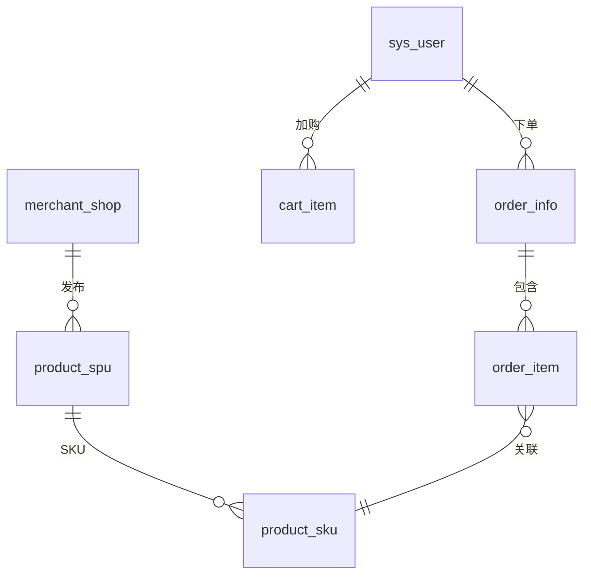

#### 用户行为与推荐 ER 图

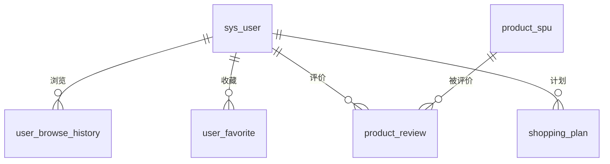

---

## 8 UI界面设计

### 8.1 前端布局体系

系统采用四种布局模板对应不同用户角色：

| 布局 | 适用角色 | 特点 |
|------|----------|------|
| PublicLayout | 所有用户 | 顶部导航 + 页脚 |
| BuyerLayout | 已登录买家 | 顶部导航 + 左侧菜单 |
| MerchantLayout | 商家 | 深色侧边栏 + 顶部栏 |
| AdminLayout | 管理员 | 紫色侧边栏 + 顶部栏 |

### 8.2 页面导航结构

```mermaid
graph LR
    R[/] --> PUB[公开]
    R --> BUY[买家]
    R --> MER[商家]
    R --> ADM[管理]
    PUB --> H[首页]
    PUB --> PL[商品列表]
    PUB --> PD[商品详情]
    BUY --> BC[购物车]
    BUY --> BO[我的订单]
    MER --> MP[商品管理]
    MER --> MO[订单管理]
    ADM --> AD[仪表盘]
    ADM --> AM[审核]
```

完整页面清单：

| 角色 | 主要页面 |
|------|----------|
| 公开 | 首页、登录、注册、商品列表、商品详情 |
| 买家 | 个人资料、收货地址、购物车、订单、评价、商家入驻 |
| 商家 | 工作台、店铺信息、商品管理/创建、订单管理 |
| 管理 | 仪表盘、商家审核、商品审核、分类管理 |

### 8.3 核心页面设计说明

#### 首页（HomeView）

首页采用 Taobao 风格三栏布局：

| 区域 | 内容 |
|------|------|
| 左侧分类面板 | 展示前 10 个分类，点击跳转搜索 |
| 中间主区域 | 橙色渐变 Hero 横幅 + 动态关键词 |
| 右侧快捷入口 | 我的订单/购物车/智能中心 |
| Hero 下方卡片 | 猜你喜欢（推荐缩略图）+ 热门推荐 |
| 热门商品区 | 6 列商品卡片网格 |
| 个性化推荐区 | 登录用户可见，6 列推荐商品 |

关键交互：
- Hero 区关键词标签从热门商品标题动态提取
- 猜你喜欢/热门卡片展示 3 个商品缩略图+价格
- 所有商品卡片点击跳转详情页

#### 商品详情页（ProductDetailView）

| 区域 | 内容 |
|------|------|
| 图片展示区 | 主图 + 图片列表轮播 |
| 基本信息区 | 标题、副标题、价格、销量 |
| SKU 选择区 | 规格选择、库存显示、数量控制 |
| 操作区 | 加入购物车、收藏按钮 |
| 店铺信息 | 店铺名称、评分 |
| 商品评价区 | 评价统计 + 评价列表（分页） |
| 相似商品区 | 推荐系统返回的相似/共购商品 |

#### 购物车页（CartView）

| 区域 | 内容 |
|------|------|
| 购物车列表 | 商品图片、名称、规格、单价、数量、小计 |
| 全选操作 | 全选/取消全选复选框 |
| 底部结算栏 | 已选件数、合计金额、结算按钮 |

#### 订单列表页（OrderListView）

| 区域 | 内容 |
|------|------|
| 状态选项卡 | 全部/待付款/待发货/待收货/已完成 |
| 订单卡片 | 订单号、时间、状态、商品摘要、金额 |
| 操作按钮 | 付款/取消/确认收货/评价/退款 |

### 8.4 权限路由守卫设计

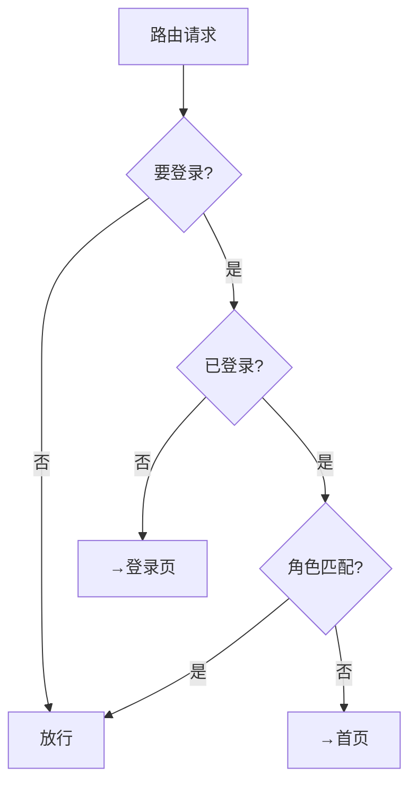

路由元信息配置：
- `meta.requiresAuth: true` — 需要登录
- `meta.requiredRole: 'ROLE_MERCHANT'` — 需要商家角色
- `meta.guest: true` — 仅未登录用户可访问

### 8.5 全局状态管理

| Store | 职责 | 持久化 |
|-------|------|--------|
| userStore | 登录态、JWT、用户信息、角色 | localStorage |
| cartStore | 购物车数据、增删改操作 | 接口同步 |
| themeStore | 暗色/亮色主题切换 | localStorage |
| localeStore | 中英文语言切换 | localStorage |

### 8.6 前后端交互封装

Axios 请求封装要点：

| 机制 | 说明 |
|------|------|
| 请求拦截器 | 自动添加 `Authorization: Bearer <token>` |
| 响应拦截器 | 统一拆包 `Result.data`，处理错误提示 |
| 401 处理 | 清除 token，重定向登录页 |
| 代理转发 | 开发环境 `/api` → `http://localhost:8080` |
| 超时设置 | 15 秒 |

---

## 附录：关键配置参数

| 配置项 | 值 | 说明 |
|--------|-----|------|
| 服务端口 | 8080 | Spring Boot |
| 前端端口 | 5173 | Vite 开发服务 |
| JWT 有效期 | 86400000ms (24h) | Token 过期时间 |
| 订单超时 | 1800000ms (30min) | 未支付自动取消 |
| 热门刷新 | 300000ms (5min) | 定时刷新热门评分 |
| 共购矩阵刷新 | 6h | 协同过滤数据重建 |
| Redis 缓存 TTL | 5min-1h | 按缓存类型区分 |
| 连接池上限 | 20 | HikariCP/Redis/Lettuce |
