# 一站式智能电商平台 — 项目需求规格说明书

> **项目名称**：Online Shopping Platform（一站式智能电商平台）  
> **版本**：v1.0  
> **编写日期**：2026-03-18  
> **技术栈**：Java 17 / Spring Boot 3.3.4 / MyBatis-Plus / Spring Security + JWT / MySQL 8 / Redis  

---

## 目录

- [1 引言](#1-引言)
- [2 用户需求说明](#2-用户需求说明)
  - [2.1 系统角色定义](#21-系统角色定义)
  - [2.2 核心业务需求（User Story）](#22-核心业务需求user-story)
  - [2.3 业务流程图](#23-业务流程图)
- [3 需求分析建模](#3-需求分析建模)
  - [3.1 用例图](#31-用例图)
  - [3.2 时序图](#32-时序图)
  - [3.3 数据建模（ER 图）](#33-数据建模er-图)
  - [3.4 数据字典](#34-数据字典)
- [4 非功能性需求说明](#4-非功能性需求说明)
  - [4.1 开发环境](#41-开发环境)
  - [4.2 运行环境](#42-运行环境)
  - [4.3 系统依赖项](#43-系统依赖项)
  - [4.4 性能需求](#44-性能需求)
  - [4.5 安全需求](#45-安全需求)
  - [4.6 可靠性与可维护性](#46-可靠性与可维护性)

---

## 1 引言

### 1.1 项目背景

本项目为课程设计级别的全栈电商平台后端系统，面向 **买家（Buyer）**、**商家（Merchant）** 和 **管理员（Administrator）** 三类用户角色。系统实现了从商品上架、浏览搜索、购物车管理、下单支付、物流发货到售后评价的完整电商业务闭环，并在此基础上融入了 AI 智能特性（RAG 商品问答、AI 文案生成、智能评论摘要、Agent 代购、定时购物计划）。

### 1.2 项目目标

| 目标 | 说明 |
|------|------|
| 完整业务闭环 | 覆盖用户注册→商品浏览→加购→下单→支付→发货→收货→评价全链路 |
| 多角色协同 | 买家、商家、管理员三端协同，权限隔离 |
| 智能化体验 | 基于 AI 的商品问答、文案生成、个性化推荐、代购 Agent |
| 高数据一致性 | 库存乐观锁防超卖、订单超时自动取消、关键数据快照 |
| 可扩展架构 | 模块化设计，便于后续扩展微服务、分布式事务等 |

### 1.3 文档范围

本文档覆盖系统全部功能模块（共 15 个业务模块、27 张数据库表、60+ REST API 端点）的需求说明、需求建模和非功能性需求。

---

## 2 用户需求说明

### 2.1 系统角色定义

| 角色 | 标识 | 说明 |
|------|------|------|
| **买家（Buyer）** | `ROLE_BUYER` | 注册后的普通用户，可浏览商品、加购、下单、支付、评价、收藏、使用 AI 功能 |
| **商家（Merchant）** | `ROLE_MERCHANT` | 通过申请审核后获得的角色，可管理店铺、发布商品、处理订单、发货、回复评价 |
| **管理员（Administrator）** | `ROLE_ADMIN` | 平台运营方，可审核商家入驻、审核商品上架、管理分类、查看平台统计数据 |
| **系统（System）** | — | 定时任务自动执行，如订单超时取消、热门商品刷新 |

### 2.2 核心业务需求（User Story）

#### 2.2.1 认证与用户管理模块

| 编号 | User Story | 验收标准 |
|------|-----------|----------|
| US-AUTH-01 | 作为访客，我希望能注册账号，以便使用平台服务 | 提供用户名、密码、昵称、手机号注册；用户名和手机号全局唯一；密码 BCrypt 加密存储；注册后默认为 ROLE_BUYER |
| US-AUTH-02 | 作为用户，我希望能登录系统并获取凭证 | 用户名+密码验证通过后返回 JWT Token；Token 包含 userId、username、roles 信息；有效期 24 小时 |
| US-USER-01 | 作为已登录用户，我希望能查看和编辑个人资料 | 可查看昵称、头像、手机号、邮箱等信息；可修改昵称、手机号、邮箱、头像 |
| US-USER-02 | 作为已登录用户，我希望能修改密码 | 需提供旧密码验证；新密码经 BCrypt 加密后更新 |

#### 2.2.2 商家管理模块

| 编号 | User Story | 验收标准 |
|------|-----------|----------|
| US-MCH-01 | 作为买家，我希望能申请成为商家 | 填写店铺名称、营业执照号、联系人信息提交申请；申请状态初始为"待审核" |
| US-MCH-02 | 作为管理员，我希望能审核商家入驻申请 | 可查看待审核列表；可批准或拒绝申请并填写备注；批准后自动创建商家店铺、用户类型升级为 MERCHANT、分配 ROLE_MERCHANT |
| US-MCH-03 | 作为商家，我希望能管理我的店铺信息 | 可查看店铺详情（名称、Logo、描述、评分）；可修改店铺名称、Logo、描述 |
| US-MCH-04 | 作为商家，我希望能查看店铺经营统计 | 显示商品总数、订单总数、销售总额、平均评分等统计数据 |

#### 2.2.3 商品管理模块

| 编号 | User Story | 验收标准 |
|------|-----------|----------|
| US-PRD-01 | 作为商家，我希望能创建商品（SPU+SKU） | 填写标题、副标题、品牌、分类、详情描述、主图；同时创建至少一个 SKU（规格、售价、原价、库存）；创建后为草稿状态、待审核 |
| US-PRD-02 | 作为商家，我希望能上下架我的商品 | 仅审核通过的商品可上架；上架后买家可搜索到；随时可下架 |
| US-PRD-03 | 作为商家，我希望能编辑和删除我的商品 | 可更新 SPU 信息及 SKU 列表；删除为逻辑删除 |
| US-PRD-04 | 作为商家，我希望能查看我的商品列表 | 分页展示自己店铺下的所有商品 |
| US-PRD-05 | 作为管理员，我希望能审核商品 | 查看待审核商品列表；可批准或拒绝；审核通过后商家可上架 |
| US-PRD-06 | 作为管理员，我希望能管理商品分类 | 创建多级分类树（支持无限层级）；设置分类排序、图标、状态 |
| US-PRD-07 | 作为访客/买家，我希望能搜索和浏览商品 | 支持关键词搜索、按分类筛选、价格排序；分页展示；商品详情页包含 SPU 信息、SKU 列表、图片 |

#### 2.2.4 购物车模块

| 编号 | User Story | 验收标准 |
|------|-----------|----------|
| US-CART-01 | 作为买家，我希望能将商品加入购物车 | 指定 SKU 和数量加入购物车；同一 SKU 再次添加时累加数量 |
| US-CART-02 | 作为买家，我希望能管理购物车 | 可查看购物车列表（包含商品信息、价格、数量、小计）；可修改数量；可勾选/取消勾选结算商品；可删除单个商品 |

#### 2.2.5 收货地址模块

| 编号 | User Story | 验收标准 |
|------|-----------|----------|
| US-ADDR-01 | 作为买家，我希望能管理我的收货地址 | 支持增删改查；可设置默认地址（每个用户仅一个默认地址）；地址信息包括收件人、电话、省/市/区、详细地址、邮编、标签 |

#### 2.2.6 订单与支付模块

| 编号 | User Story | 验收标准 |
|------|-----------|----------|
| US-ORD-01 | 作为买家，我希望能提交订单 | 从购物车中选中的商品创建订单；需指定收货地址；订单按店铺拆分；提交时锁定库存（乐观锁）；生成唯一订单号 |
| US-ORD-02 | 作为买家，我希望能支付订单 | 模拟支付流程；支付成功后订单状态变为"待发货"；扣减锁定库存；生成支付记录 |
| US-ORD-03 | 作为买家，我希望能取消未支付的订单 | 仅未支付订单可取消；取消后释放锁定库存 |
| US-ORD-04 | 作为买家，我希望未支付订单能自动取消 | 超过 30 分钟未支付的订单由系统自动取消；通过 Redis ZSet 实现延时队列；定时任务每 60 秒扫描 |
| US-ORD-05 | 作为买家，我希望能查看我的订单列表和详情 | 分页查询；支持按状态筛选；详情包含订单项、收货信息、支付信息、物流信息 |
| US-ORD-06 | 作为买家，我希望能确认收货 | 仅"待收货"状态可确认；确认后订单完成 |
| US-ORD-07 | 作为买家，我希望能申请退款 | 已支付但未完成的订单可申请退款；需填写退款原因；状态变为"退款中" |
| US-ORD-08 | 作为商家，我希望能处理订单发货 | 查看待发货订单；执行发货操作后状态变为"待收货" |
| US-ORD-09 | 作为商家，我希望能处理退款申请 | 可批准或拒绝退款；批准后库存返还、订单状态变为"已退款" |
| US-ORD-10 | 作为商家，我希望能查看我店铺的订单列表 | 分页展示店铺所有订单；支持状态筛选 |

#### 2.2.7 评价模块

| 编号 | User Story | 验收标准 |
|------|-----------|----------|
| US-REV-01 | 作为买家，我希望能对已完成的订单商品进行评价 | 仅已收货且未评价的订单项可评价；支持 1-5 星评分、文字评论、图片上传；可匿名评价 |
| US-REV-02 | 作为商家，我希望能回复买家评价 | 可对评价进行文字回复 |
| US-REV-03 | 作为访客/买家，我希望能查看商品评价 | 分页展示商品评价列表；查看评分统计（平均分、各星级分布） |

#### 2.2.8 收藏与浏览历史模块

| 编号 | User Story | 验收标准 |
|------|-----------|----------|
| US-FAV-01 | 作为买家，我希望能收藏/取消收藏商品 | Toggle 操作，已收藏则取消，未收藏则添加；SPU 收藏数同步更新 |
| US-FAV-02 | 作为买家，我希望能查看我的收藏列表 | 分页展示收藏的商品信息 |
| US-FAV-03 | 作为买家，我希望能检查某商品是否已收藏 | 返回布尔值 |
| US-BH-01 | 作为买家，我希望浏览商品时自动记录历史 | 查看商品详情时自动记录；同一商品重复浏览更新时间 |
| US-BH-02 | 作为买家，我希望能查看和清空浏览历史 | 分页按时间倒序展示；支持一键清空 |

#### 2.2.9 推荐模块

| 编号 | User Story | 验收标准 |
|------|-----------|----------|
| US-REC-01 | 作为访客/买家，我希望能看到热门商品推荐 | 基于 Redis ZSet 按销量排序的热门商品；支持指定返回数量 |
| US-REC-02 | 作为访客/买家，我希望在商品详情页看到相似商品推荐 | 基于同分类同店铺的相似商品推荐 |
| US-REC-03 | 作为买家，我希望获得个性化推荐 | 基于浏览历史和收藏偏好的个性化推荐 |

#### 2.2.10 AI 智能模块

| 编号 | User Story | 验收标准 |
|------|-----------|----------|
| US-RAG-01 | 作为买家，我希望能向 AI 咨询商品问题 | 基于 RAG 的商品知识问答；维护会话上下文；返回 AI 回答和来源 |
| US-RAG-02 | 作为买家，我希望能查看 AI 对话历史 | 按会话查看历史消息 |
| US-RAG-03 | 作为商家，我希望能导入商品知识库 | 从商品信息和评价自动生成知识文档 |
| US-AI-01 | 作为商家，我希望 AI 能帮我生成商品标题 | 基于商品信息自动生成营销标题 |
| US-AI-02 | 作为商家，我希望 AI 能帮我生成商品描述 | 根据标题、关键词、目标人群生成描述文案 |
| US-AI-03 | 作为商家，我希望 AI 能帮我提取商品卖点 | 基于商品信息和评价提取核心卖点 |
| US-AI-04 | 作为访客/买家，我希望能看到 AI 评论摘要 | AI 总结评论优缺点和总体评价 |

#### 2.2.11 Agent 代购模块

| 编号 | User Story | 验收标准 |
|------|-----------|----------|
| US-AGT-01 | 作为买家，我希望能用自然语言描述需求让 AI 代购 | 输入自然语言描述（如"帮我找一个 500 元以内的手机壳"）；AI 解析预算、关键词、分类等；自动搜索匹配商品并返回推荐 |
| US-AGT-02 | 作为买家，我希望能查看 Agent 任务结果 | 查看任务状态和推荐商品列表 |
| US-AGT-03 | 作为买家，我希望能将 Agent 推荐的商品加入购物车 | 选择推荐中的商品一键加入购物车 |

#### 2.2.12 定时购物计划模块

| 编号 | User Story | 验收标准 |
|------|-----------|----------|
| US-PLN-01 | 作为买家，我希望能创建购物计划 | 设定计划名称、触发时间、预算金额；添加计划商品项（关键词、分类、期望价格区间、数量） |
| US-PLN-02 | 作为买家，我希望能管理我的购物计划 | 查看计划列表和详情；取消计划 |
| US-PLN-03 | 作为买家，我希望能手动执行购物计划 | 执行时自动匹配商品并加入购物车 |

#### 2.2.13 管理员后台模块

| 编号 | User Story | 验收标准 |
|------|-----------|----------|
| US-ADM-01 | 作为管理员，我希望能查看平台运营数据 | 仪表盘展示：用户总数、商家总数、商品总数、订单总数、GMV、今日新增订单 |
| US-ADM-02 | 作为管理员，我希望能审核商品上架 | 批准或拒绝商家提交的商品审核申请 |
| US-ADM-03 | 作为管理员，我希望能审核商家入驻 | 批准或拒绝用户的商家入驻申请 |

### 2.3 业务流程图

#### 2.3.1 注册与登录流程

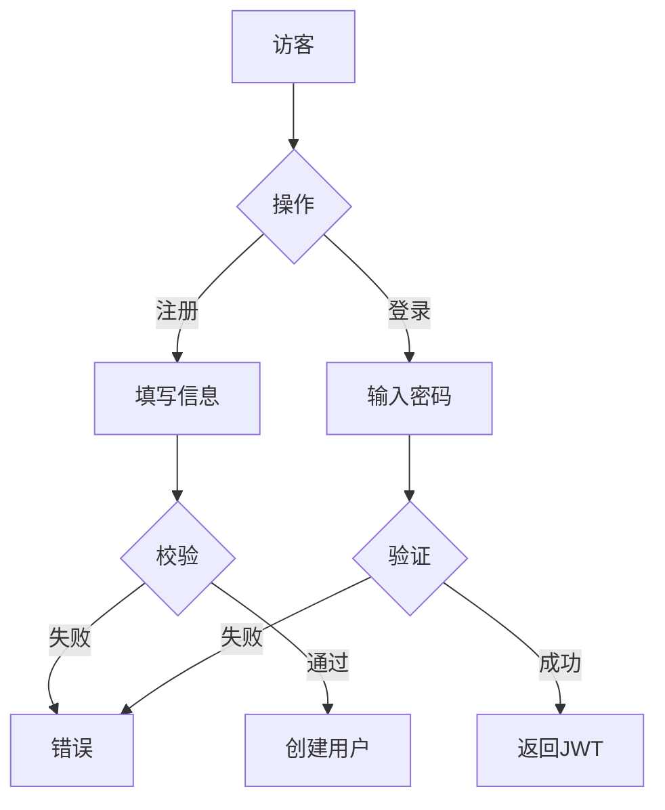
```mermaid
flowchart TD
    A[访客] --> B{操作}
    B -->|注册| C[填写信息]
    C --> D{校验}
    D -->|失败| E[错误]
    D -->|通过| F[创建用户]
    B -->|登录| G[输入密码]
    G --> H{验证}
    H -->|失败| E
    H -->|成功| I[返回JWT]
```

#### 2.3.2 商家入驻流程

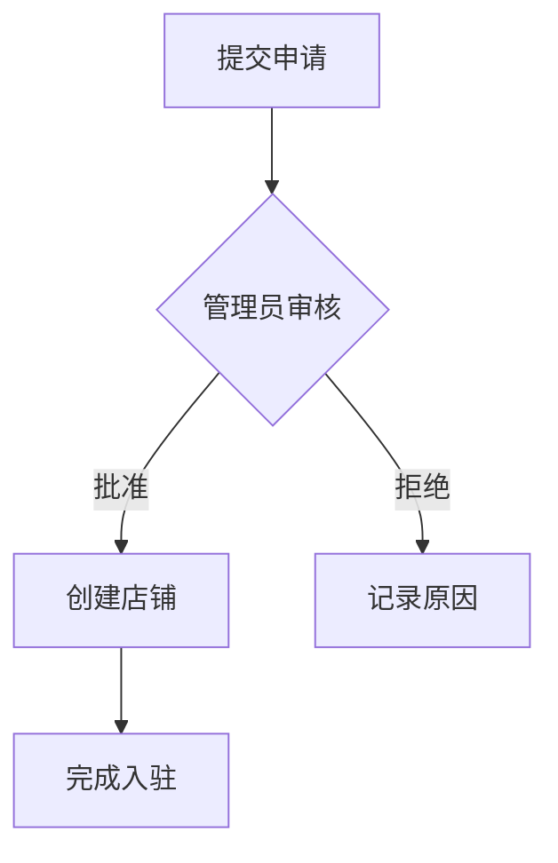
```mermaid
flowchart TD
    A[提交申请] --> B{管理员审核}
    B -->|批准| C[创建店铺]
    C --> D[完成入驻]
    B -->|拒绝| E[记录原因]
```

#### 2.3.3 商品发布审核流程

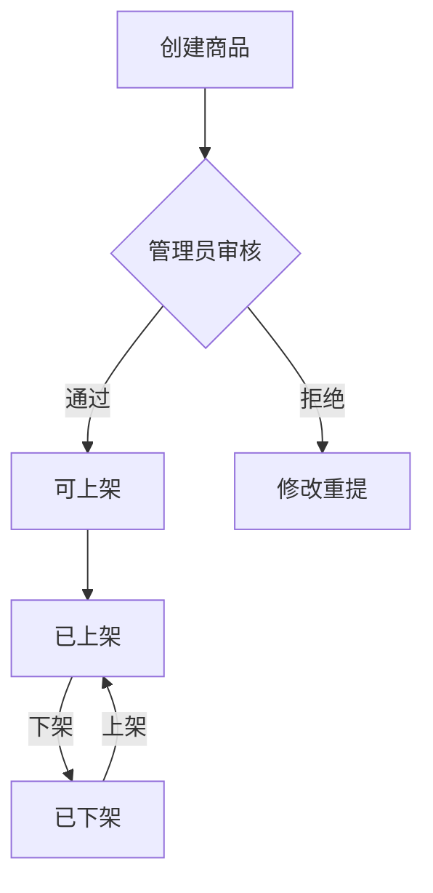
```mermaid
flowchart TD
    A[创建商品] --> B{管理员审核}
    B -->|通过| C[可上架]
    B -->|拒绝| D[修改重提]
    C --> E[已上架]
    E -->|下架| F[已下架]
    F -->|上架| E
```

#### 2.3.4 购物下单流程

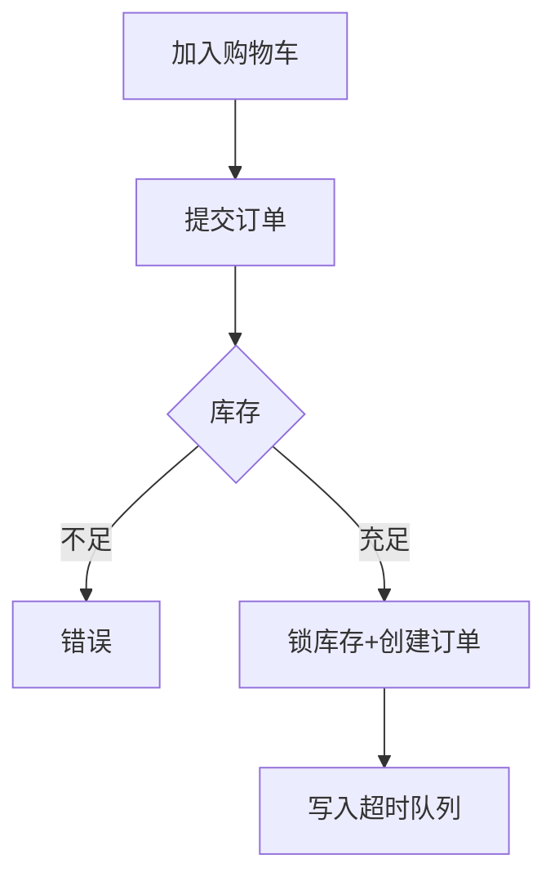
```mermaid
flowchart TD
    A[加入购物车] --> B[提交订单]
    B --> C{库存}
    C -->|不足| D[错误]
    C -->|充足| E[锁库存+创建订单]
    E --> F[写入超时队列]
```

#### 2.3.5 订单支付与取消

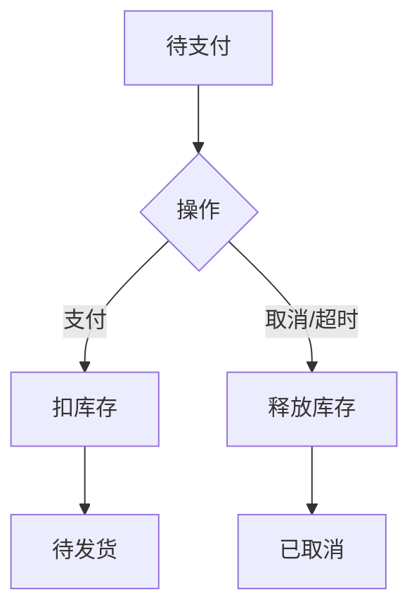
```mermaid
flowchart TD
    A[待支付] --> B{操作}
    B -->|支付| C[扣库存]
    C --> D[待发货]
    B -->|取消/超时| E[释放库存]
    E --> F[已取消]
```

#### 2.3.6 订单状态机

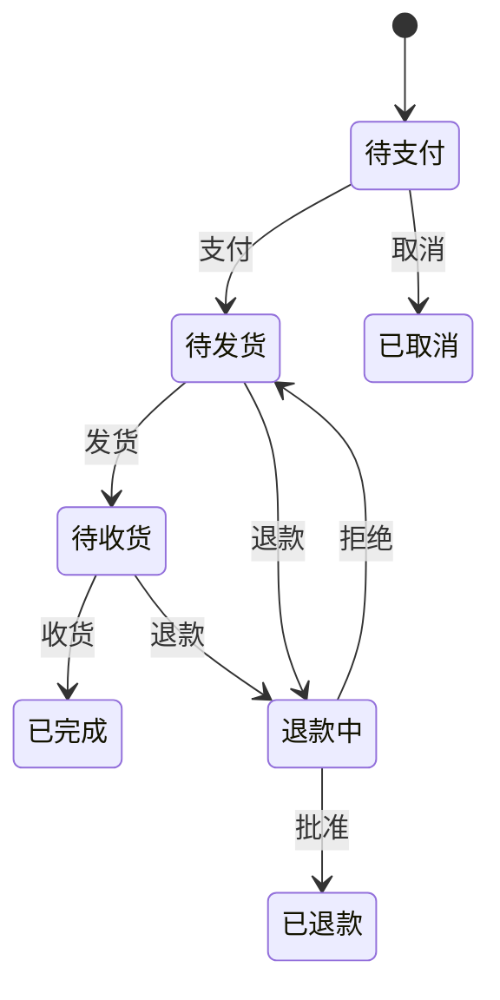
```mermaid
stateDiagram-v2
    [*] --> 待支付
    待支付 --> 待发货: 支付
    待支付 --> 已取消: 取消
    待发货 --> 待收货: 发货
    待发货 --> 退款中: 退款
    待收货 --> 已完成: 收货
    待收货 --> 退款中: 退款
    退款中 --> 已退款: 批准
    退款中 --> 待发货: 拒绝
```

#### 2.3.7 退款流程

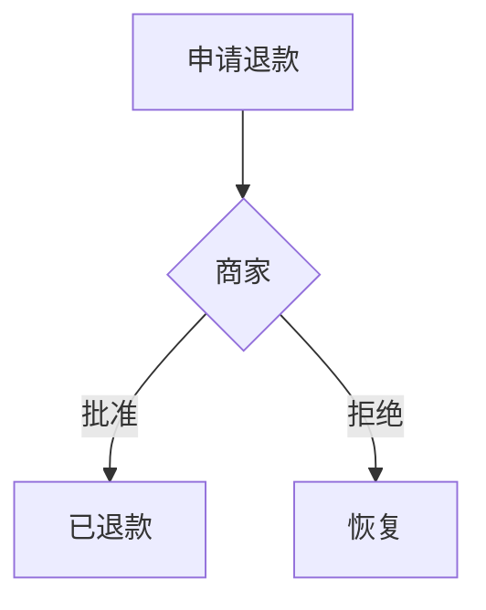
```mermaid
flowchart TD
    A[申请退款] --> B{商家}
    B -->|批准| C[已退款]
    B -->|拒绝| D[恢复]
```

#### 2.3.8 Agent代购流程

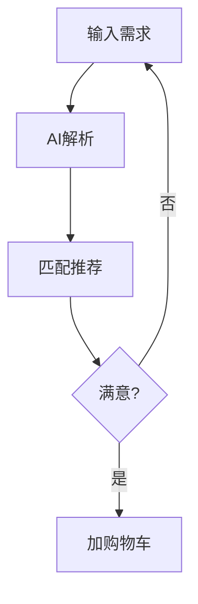
```mermaid
flowchart TD
    A[输入需求] --> B[AI解析]
    B --> C[匹配推荐]
    C --> D{满意?}
    D -->|是| E[加购物车]
    D -->|否| A
```

---

## 3 需求分析建模

### 3.1 用例图

以下用例图按角色分组，每组仅列出核心用例。

#### 3.1.1 访客与买家用例

| 角色 | 用例 |
|------|------|
| 访客 | 搜索商品、查看详情、浏览分类、查看评价、热门推荐、AI评论摘要 |
| 买家 | 注册/登录、管理资料、购物车、地址管理、下单支付、取消订单、确认收货、申请退款、评价、收藏/历史、AI问答、Agent代购、购物计划、申请成为商家 |

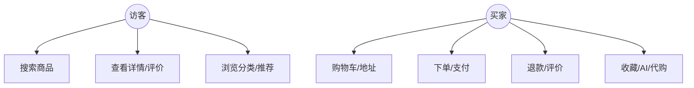
```mermaid
graph TD
    A((访客)) --> B[搜索商品]
    A --> C[查看详情/评价]
    A --> D[浏览分类/推荐]
    E((买家)) --> F[购物车/地址]
    E --> G[下单/支付]
    E --> H[退款/评价]
    E --> I[收藏/AI/代购]
```

#### 3.1.2 商家与管理员用例

| 角色 | 用例 |
|------|------|
| 商家 | 管理店铺、商品管理(创建/上下架)、订单发货、处理退款、回复评价、AI文案/知识库 |
| 管理员 | 运营仪表盘、审核商家、审核商品、管理分类 |
| 系统 | 订单超时取消、热门商品刷新 |

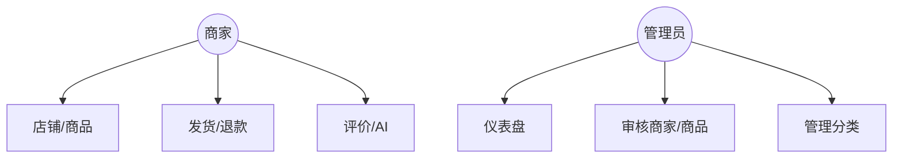
```mermaid
graph TD
    A((商家)) --> B[店铺/商品]
    A --> C[发货/退款]
    A --> D[评价/AI]
    E((管理员)) --> F[仪表盘]
    E --> G[审核商家/商品]
    E --> H[管理分类]
```

#### 3.1.3 订单子系统用例

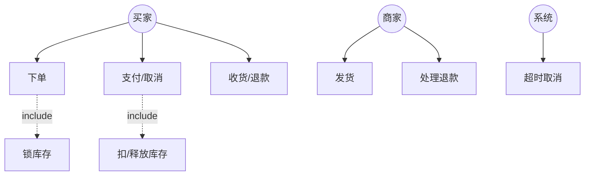
```mermaid
graph TD
    A((买家)) --> B[下单]
    A --> C[支付/取消]
    A --> D[收货/退款]
    E((商家)) --> F[发货]
    E --> G[处理退款]
    H((系统)) --> I[超时取消]
    B -.->|include| J[锁库存]
    C -.->|include| K[扣/释放库存]
```

### 3.2 时序图

#### 3.2.1 用户注册时序图

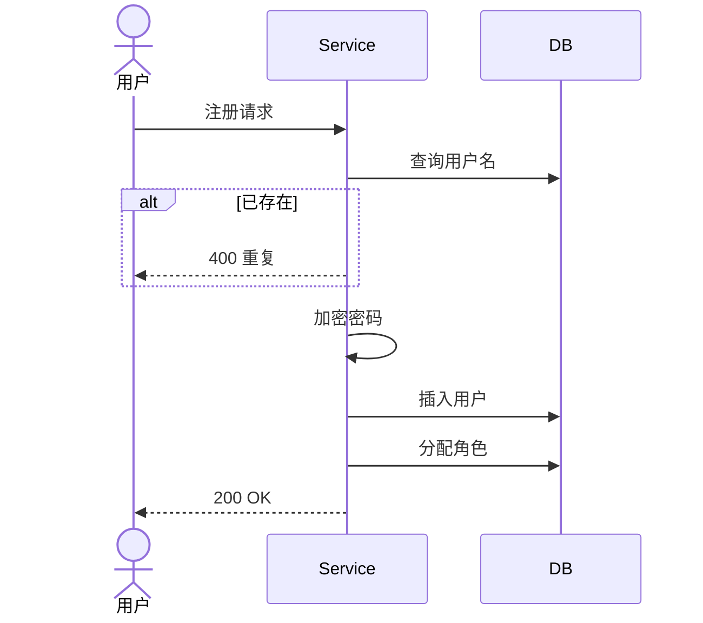
```mermaid
sequenceDiagram
    actor U as 用户
    participant S as Service
    participant DB as DB

    U->>S: 注册请求
    S->>DB: 查询用户名
    alt 已存在
        S-->>U: 400 重复
    end
    S->>S: 加密密码
    S->>DB: 插入用户
    S->>DB: 分配角色
    S-->>U: 200 OK
```

#### 3.2.2 用户登录时序图

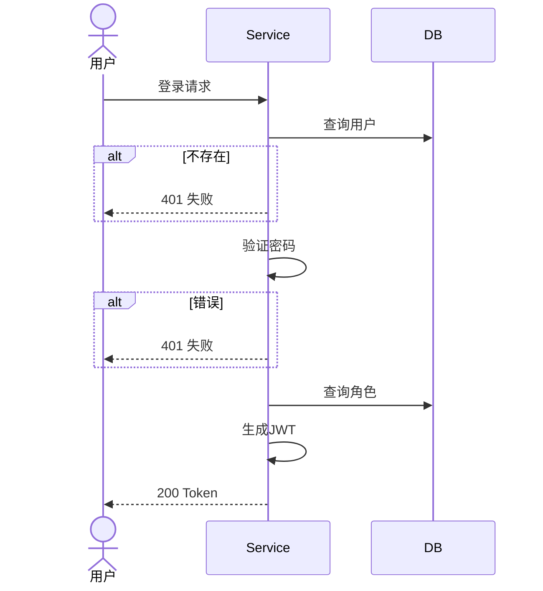
```mermaid
sequenceDiagram
    actor U as 用户
    participant S as Service
    participant DB as DB

    U->>S: 登录请求
    S->>DB: 查询用户
    alt 不存在
        S-->>U: 401 失败
    end
    S->>S: 验证密码
    alt 错误
        S-->>U: 401 失败
    end
    S->>DB: 查询角色
    S->>S: 生成JWT
    S-->>U: 200 Token
```

#### 3.2.3 JWT 请求认证时序图

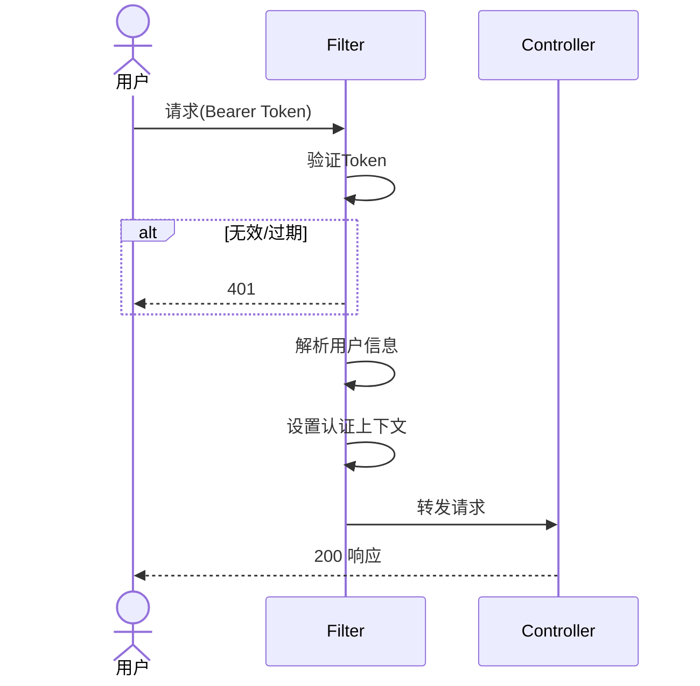
```mermaid
sequenceDiagram
    actor U as 用户
    participant F as Filter
    participant C as Controller

    U->>F: 请求(Bearer Token)
    F->>F: 验证Token
    alt 无效/过期
        F-->>U: 401
    end
    F->>F: 解析用户信息
    F->>F: 设置认证上下文
    F->>C: 转发请求
    C-->>U: 200 响应
```

#### 3.2.4 提交订单时序图

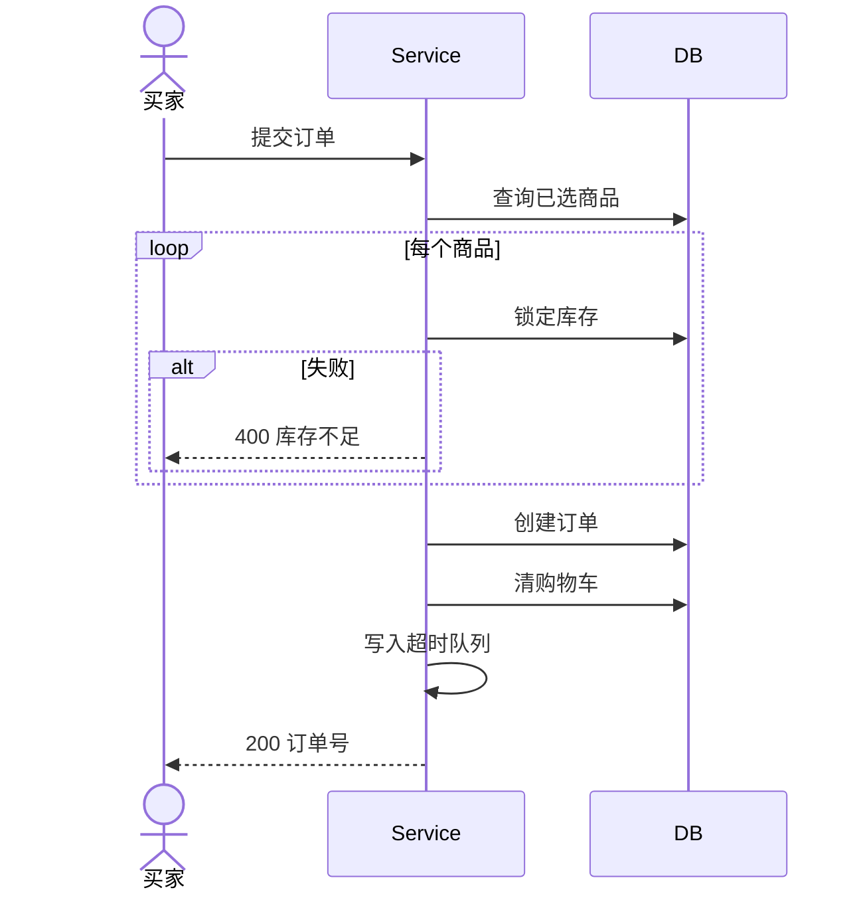
```mermaid
sequenceDiagram
    actor U as 买家
    participant S as Service
    participant DB as DB

    U->>S: 提交订单
    S->>DB: 查询已选商品
    loop 每个商品
        S->>DB: 锁定库存
        alt 失败
            S-->>U: 400 库存不足
        end
    end
    S->>DB: 创建订单
    S->>DB: 清购物车
    S->>S: 写入超时队列
    S-->>U: 200 订单号
```

#### 3.2.5 订单超时自动取消时序图

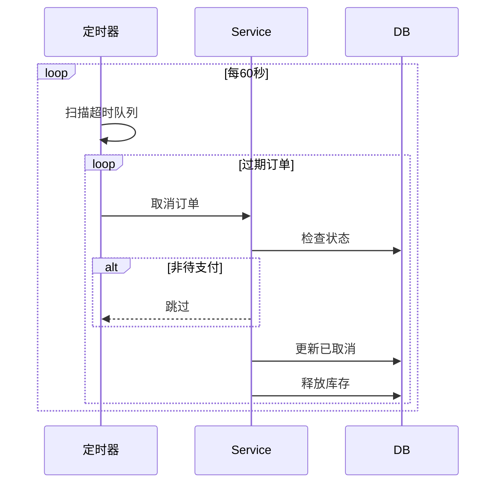
```mermaid
sequenceDiagram
    participant T as 定时器
    participant S as Service
    participant DB as DB

    loop 每60秒
        T->>T: 扫描超时队列
        loop 过期订单
            T->>S: 取消订单
            S->>DB: 检查状态
            alt 非待支付
                S-->>T: 跳过
            end
            S->>DB: 更新已取消
            S->>DB: 释放库存
        end
    end
```

#### 3.2.6 支付订单时序图

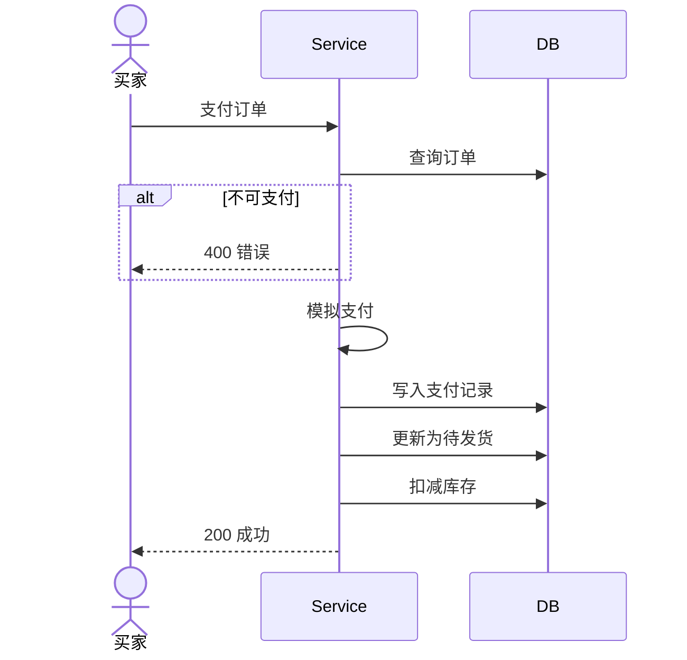
```mermaid
sequenceDiagram
    actor U as 买家
    participant S as Service
    participant DB as DB

    U->>S: 支付订单
    S->>DB: 查询订单
    alt 不可支付
        S-->>U: 400 错误
    end
    S->>S: 模拟支付
    S->>DB: 写入支付记录
    S->>DB: 更新为待发货
    S->>DB: 扣减库存
    S-->>U: 200 成功
```

#### 3.2.7 商品搜索时序图

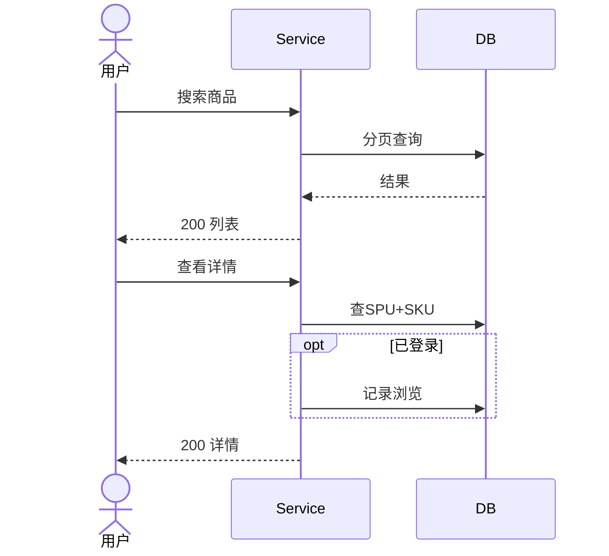
```mermaid
sequenceDiagram
    actor U as 用户
    participant S as Service
    participant DB as DB

    U->>S: 搜索商品
    S->>DB: 分页查询
    DB-->>S: 结果
    S-->>U: 200 列表

    U->>S: 查看详情
    S->>DB: 查SPU+SKU
    opt 已登录
        S->>DB: 记录浏览
    end
    S-->>U: 200 详情
```

### 3.3 数据建模（ER 图）

#### 3.3.1 总体实体关系概览

以下用文本形式列出全部 27 张表的关系，随后按模块分别绘制 ER 图。

```
sys_user (1) ──< (N) sys_user_role (N) >── (1) sys_role
sys_role (1) ──< (N) sys_role_permission (N) >── (1) sys_permission

sys_user (1) ──── (0..1) merchant_shop
sys_user (1) ──< (N) merchant_apply

merchant_shop (1) ──< (N) product_spu
product_category (1) ──< (N) product_spu
product_spu (1) ──< (N) product_sku
product_spu (1) ──< (N) product_image

sys_user (1) ──< (N) cart_item (N) >── (1) product_sku
sys_user (1) ──< (N) user_address

sys_user (1) ──< (N) order_info (N) >── (1) merchant_shop
order_info (1) ──< (N) order_item
order_info (1) ──< (N) order_operate_log
order_info (1) ──< (N) payment_record
product_sku (1) ──< (N) inventory_log

order_item (1) ──── (0..1) product_review
sys_user (1) ──< (N) product_review

sys_user (1) ──< (N) user_favorite (N) >── (1) product_spu
sys_user (1) ──< (N) user_browse_history (N) >── (1) product_spu

product_spu (1) ──< (N) product_knowledge_doc
sys_user (1) ──< (N) ai_chat_session ──< (N) ai_chat_message
sys_user (1) ──< (N) shopping_plan ──< (N) shopping_plan_item
sys_user (1) ──< (N) agent_task
```

#### 3.3.2 用户与权限 ER 图

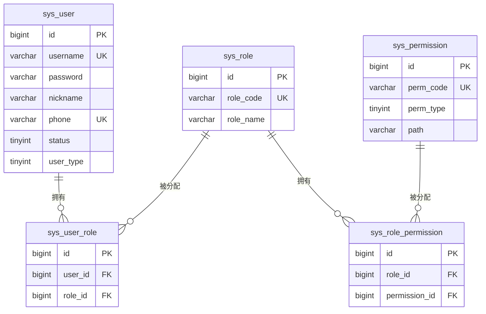
```mermaid
erDiagram
    sys_user ||--o{ sys_user_role : "拥有"
    sys_role ||--o{ sys_user_role : "被分配"
    sys_role ||--o{ sys_role_permission : "拥有"
    sys_permission ||--o{ sys_role_permission : "被分配"

    sys_user {
        bigint id PK
        varchar username UK
        varchar password
        varchar nickname
        varchar phone UK
        tinyint status
        tinyint user_type
    }

    sys_role {
        bigint id PK
        varchar role_code UK
        varchar role_name
    }

    sys_permission {
        bigint id PK
        varchar perm_code UK
        tinyint perm_type
        varchar path
    }

    sys_user_role {
        bigint id PK
        bigint user_id FK
        bigint role_id FK
    }

    sys_role_permission {
        bigint id PK
        bigint role_id FK
        bigint permission_id FK
    }
```

#### 3.3.3 商家模块 ER 图

```mermaid
erDiagram
    sys_user ||--o| merchant_shop : "拥有店铺"
    sys_user ||--o{ merchant_apply : "提交申请"

    merchant_apply {
        bigint id PK
        bigint user_id FK
        varchar shop_name
        varchar business_license_no
        tinyint apply_status
        bigint audit_by
    }

    merchant_shop {
        bigint id PK
        bigint user_id FK_UK
        varchar shop_name
        varchar shop_logo
        tinyint shop_status
        decimal score
    }
```

#### 3.3.4 商品模块 ER 图

```mermaid
erDiagram
    merchant_shop ||--o{ product_spu : "发布"
    product_category ||--o{ product_spu : "归属"
    product_spu ||--o{ product_sku : "包含SKU"
    product_spu ||--o{ product_image : "包含图片"

    product_category {
        bigint id PK
        bigint parent_id
        varchar category_name
        tinyint level
        int sort_order
    }

    product_spu {
        bigint id PK
        bigint shop_id FK
        bigint category_id FK
        varchar title
        tinyint status
        tinyint audit_status
        decimal min_price
        decimal max_price
        int sales_count
    }

    product_sku {
        bigint id PK
        bigint spu_id FK
        varchar sku_code UK
        decimal sale_price
        int stock
        int lock_stock
        int version
    }

    product_image {
        bigint id PK
        bigint spu_id FK
        bigint sku_id
        varchar image_url
        tinyint image_type
    }
```

#### 3.3.5 购物车与收货地址 ER 图

```mermaid
erDiagram
    sys_user ||--o{ cart_item : "购物车"
    product_sku ||--o{ cart_item : "被加购"
    sys_user ||--o{ user_address : "收货地址"

    cart_item {
        bigint id PK
        bigint user_id FK
        bigint sku_id FK
        int quantity
        tinyint checked
    }

    user_address {
        bigint id PK
        bigint user_id FK
        varchar receiver_name
        varchar receiver_phone
        varchar province
        varchar city
        varchar district
        varchar detail_address
        tinyint is_default
    }
```

#### 3.3.6 订单与支付 ER 图

```mermaid
erDiagram
    sys_user ||--o{ order_info : "下单"
    merchant_shop ||--o{ order_info : "接单"
    order_info ||--o{ order_item : "包含商品"
    order_info ||--o{ order_operate_log : "操作日志"
    order_info ||--o{ payment_record : "支付记录"
    product_sku ||--o{ inventory_log : "库存变动"

    order_info {
        bigint id PK
        varchar order_no UK
        bigint user_id FK
        bigint shop_id FK
        decimal pay_amount
        tinyint order_status
        tinyint pay_status
        tinyint source_type
    }

    order_item {
        bigint id PK
        bigint order_id FK
        varchar order_no
        bigint sku_id
        varchar product_title
        decimal sale_price
        int quantity
        decimal total_amount
    }

    order_operate_log {
        bigint id PK
        bigint order_id FK
        tinyint before_status
        tinyint after_status
        varchar operate_type
    }

    payment_record {
        bigint id PK
        varchar order_no FK
        varchar pay_no UK
        decimal pay_amount
        tinyint pay_status
    }

    inventory_log {
        bigint id PK
        bigint sku_id FK
        varchar order_no
        int change_count
        varchar operate_type
    }
```

#### 3.3.7 评价与用户行为 ER 图

```mermaid
erDiagram
    order_item ||--o| product_review : "评价"
    sys_user ||--o{ product_review : "发表"
    sys_user ||--o{ user_favorite : "收藏"
    product_spu ||--o{ user_favorite : "被收藏"
    sys_user ||--o{ user_browse_history : "浏览"
    product_spu ||--o{ user_browse_history : "被浏览"

    product_review {
        bigint id PK
        bigint order_item_id FK
        bigint user_id FK
        bigint spu_id FK
        tinyint score
        varchar content
        tinyint anonymous_flag
    }

    user_favorite {
        bigint id PK
        bigint user_id FK
        bigint spu_id FK
    }

    user_browse_history {
        bigint id PK
        bigint user_id FK
        bigint spu_id FK
        datetime browse_time
    }
```

#### 3.3.8 RAG 与 AI 会话 ER 图

```mermaid
erDiagram
    product_spu ||--o{ product_knowledge_doc : "知识"
    sys_user ||--o{ ai_chat_session : "会话"
    ai_chat_session ||--o{ ai_chat_message : "消息"

    product_knowledge_doc {
        bigint id PK
        bigint spu_id FK
        varchar title
        varchar source_type
    }

    ai_chat_session {
        bigint id PK
        bigint user_id FK
        varchar session_type
    }

    ai_chat_message {
        bigint id PK
        bigint session_id FK
        varchar role
    }
```

#### 3.3.9 购物计划与 Agent ER 图

```mermaid
erDiagram
    sys_user ||--o{ shopping_plan : "计划"
    shopping_plan ||--o{ shopping_plan_item : "项"
    sys_user ||--o{ agent_task : "任务"

    shopping_plan {
        bigint id PK
        bigint user_id FK
        varchar plan_name
        tinyint plan_status
    }

    shopping_plan_item {
        bigint id PK
        bigint plan_id FK
        varchar keyword
        int quantity
    }

    agent_task {
        bigint id PK
        bigint user_id FK
        varchar task_type
        tinyint task_status
    }
```

### 3.4 数据字典

#### 3.4.1 用户与权限模块

##### 表：`sys_user` — 用户账户表

| 字段名 | 类型 | 约束 | 说明 |
|--------|------|------|------|
| `id` | BIGINT | PK, AUTO_INCREMENT | 用户唯一标识 |
| `username` | VARCHAR(64) | NOT NULL, UNIQUE | 登录用户名 |
| `password` | VARCHAR(255) | NOT NULL | BCrypt 加密密码 |
| `nickname` | VARCHAR(64) | — | 显示昵称 |
| `phone` | VARCHAR(20) | UNIQUE | 手机号 |
| `email` | VARCHAR(128) | — | 电子邮箱 |
| `avatar_url` | VARCHAR(255) | — | 头像 URL |
| `status` | TINYINT | NOT NULL, DEFAULT 1 | 账户状态：0=禁用, 1=启用 |
| `user_type` | TINYINT | NOT NULL, DEFAULT 1 | 用户类型：1=买家, 2=商家, 3=管理员 |
| `last_login_time` | DATETIME | — | 最后登录时间 |
| `create_time` | DATETIME | NOT NULL, DEFAULT CURRENT_TIMESTAMP | 创建时间 |
| `update_time` | DATETIME | NOT NULL, ON UPDATE CURRENT_TIMESTAMP | 更新时间 |
| `deleted` | TINYINT | NOT NULL, DEFAULT 0 | 逻辑删除：0=正常, 1=已删除 |

##### 表：`sys_role` — 角色表

| 字段名 | 类型 | 约束 | 说明 |
|--------|------|------|------|
| `id` | BIGINT | PK, AUTO_INCREMENT | 角色唯一标识 |
| `role_code` | VARCHAR(64) | NOT NULL, UNIQUE | 角色编码（如 ROLE_BUYER） |
| `role_name` | VARCHAR(64) | NOT NULL | 角色名称 |
| `status` | TINYINT | NOT NULL, DEFAULT 1 | 状态：0=禁用, 1=启用 |
| `create_time` | DATETIME | NOT NULL, DEFAULT CURRENT_TIMESTAMP | 创建时间 |
| `update_time` | DATETIME | NOT NULL, ON UPDATE CURRENT_TIMESTAMP | 更新时间 |
| `deleted` | TINYINT | NOT NULL, DEFAULT 0 | 逻辑删除 |

##### 表：`sys_permission` — 权限表

| 字段名 | 类型 | 约束 | 说明 |
|--------|------|------|------|
| `id` | BIGINT | PK, AUTO_INCREMENT | 权限唯一标识 |
| `perm_code` | VARCHAR(128) | NOT NULL, UNIQUE | 权限编码 |
| `perm_name` | VARCHAR(64) | NOT NULL | 权限名称 |
| `perm_type` | TINYINT | NOT NULL | 权限类型：1=菜单, 2=按钮, 3=API |
| `path` | VARCHAR(255) | — | API 路径或菜单路由 |
| `method` | VARCHAR(10) | — | HTTP 方法 |
| `parent_id` | BIGINT | DEFAULT 0 | 父权限 ID（0 为顶级） |
| `status` | TINYINT | NOT NULL, DEFAULT 1 | 状态：0=禁用, 1=启用 |
| `create_time` | DATETIME | NOT NULL, DEFAULT CURRENT_TIMESTAMP | 创建时间 |
| `update_time` | DATETIME | NOT NULL, ON UPDATE CURRENT_TIMESTAMP | 更新时间 |
| `deleted` | TINYINT | NOT NULL, DEFAULT 0 | 逻辑删除 |

##### 表：`sys_user_role` — 用户-角色关联表

| 字段名 | 类型 | 约束 | 说明 |
|--------|------|------|------|
| `id` | BIGINT | PK, AUTO_INCREMENT | 关联唯一标识 |
| `user_id` | BIGINT | NOT NULL, UK(user_id, role_id) | 用户 ID |
| `role_id` | BIGINT | NOT NULL, UK(user_id, role_id) | 角色 ID |
| `create_time` | DATETIME | NOT NULL, DEFAULT CURRENT_TIMESTAMP | 创建时间 |

##### 表：`sys_role_permission` — 角色-权限关联表

| 字段名 | 类型 | 约束 | 说明 |
|--------|------|------|------|
| `id` | BIGINT | PK, AUTO_INCREMENT | 关联唯一标识 |
| `role_id` | BIGINT | NOT NULL, UK(role_id, permission_id) | 角色 ID |
| `permission_id` | BIGINT | NOT NULL, UK(role_id, permission_id) | 权限 ID |
| `create_time` | DATETIME | NOT NULL, DEFAULT CURRENT_TIMESTAMP | 创建时间 |

#### 3.4.2 商家模块

##### 表：`merchant_apply` — 商家入驻申请表

| 字段名 | 类型 | 约束 | 说明 |
|--------|------|------|------|
| `id` | BIGINT | PK, AUTO_INCREMENT | 申请唯一标识 |
| `user_id` | BIGINT | NOT NULL | 申请用户 ID |
| `shop_name` | VARCHAR(128) | NOT NULL | 期望店铺名称 |
| `business_license_no` | VARCHAR(128) | — | 营业执照号 |
| `contact_name` | VARCHAR(64) | — | 联系人姓名 |
| `contact_phone` | VARCHAR(20) | — | 联系电话 |
| `apply_status` | TINYINT | NOT NULL, DEFAULT 0 | 申请状态：0=待审核, 1=已批准, 2=已拒绝 |
| `remark` | VARCHAR(255) | — | 申请备注 |
| `audit_by` | BIGINT | — | 审核管理员 ID |
| `audit_time` | DATETIME | — | 审核时间 |
| `create_time` | DATETIME | NOT NULL, DEFAULT CURRENT_TIMESTAMP | 申请时间 |
| `update_time` | DATETIME | NOT NULL, ON UPDATE CURRENT_TIMESTAMP | 更新时间 |

##### 表：`merchant_shop` — 商家店铺表

| 字段名 | 类型 | 约束 | 说明 |
|--------|------|------|------|
| `id` | BIGINT | PK, AUTO_INCREMENT | 店铺唯一标识 |
| `user_id` | BIGINT | NOT NULL, UNIQUE | 店主用户 ID（一人一店） |
| `shop_name` | VARCHAR(128) | NOT NULL | 店铺名称 |
| `shop_logo` | VARCHAR(255) | — | 店铺 Logo URL |
| `shop_desc` | VARCHAR(500) | — | 店铺描述 |
| `shop_status` | TINYINT | NOT NULL, DEFAULT 1 | 状态：0=禁用, 1=启用 |
| `score` | DECIMAL(3,2) | DEFAULT 5.00 | 店铺评分（1.00-5.00） |
| `create_time` | DATETIME | NOT NULL, DEFAULT CURRENT_TIMESTAMP | 创建时间 |
| `update_time` | DATETIME | NOT NULL, ON UPDATE CURRENT_TIMESTAMP | 更新时间 |
| `deleted` | TINYINT | NOT NULL, DEFAULT 0 | 逻辑删除 |

#### 3.4.3 商品模块

##### 表：`product_category` — 商品分类表

| 字段名 | 类型 | 约束 | 说明 |
|--------|------|------|------|
| `id` | BIGINT | PK, AUTO_INCREMENT | 分类唯一标识 |
| `parent_id` | BIGINT | NOT NULL, DEFAULT 0 | 父分类 ID（0 为根节点） |
| `category_name` | VARCHAR(64) | NOT NULL | 分类名称 |
| `level` | TINYINT | NOT NULL, DEFAULT 1 | 层级：1=一级, 2=二级, ... |
| `sort_order` | INT | NOT NULL, DEFAULT 0 | 排序序号 |
| `icon` | VARCHAR(255) | — | 分类图标 URL |
| `status` | TINYINT | NOT NULL, DEFAULT 1 | 状态：0=禁用, 1=启用 |
| `create_time` | DATETIME | NOT NULL, DEFAULT CURRENT_TIMESTAMP | 创建时间 |
| `update_time` | DATETIME | NOT NULL, ON UPDATE CURRENT_TIMESTAMP | 更新时间 |
| `deleted` | TINYINT | NOT NULL, DEFAULT 0 | 逻辑删除 |

##### 表：`product_spu` — 商品 SPU 表（标准产品单元）

| 字段名 | 类型 | 约束 | 说明 |
|--------|------|------|------|
| `id` | BIGINT | PK, AUTO_INCREMENT | SPU 唯一标识 |
| `shop_id` | BIGINT | NOT NULL | 所属店铺 ID |
| `category_id` | BIGINT | — | 所属分类 ID |
| `brand_name` | VARCHAR(64) | — | 品牌名称 |
| `title` | VARCHAR(255) | NOT NULL | 商品标题 |
| `sub_title` | VARCHAR(255) | — | 副标题 |
| `main_image` | VARCHAR(255) | — | 主图 URL |
| `detail_text` | TEXT | — | 详情描述（HTML） |
| `status` | TINYINT | NOT NULL, DEFAULT 0 | 状态：0=草稿, 1=已上架, 2=已下架 |
| `audit_status` | TINYINT | NOT NULL, DEFAULT 0 | 审核：0=待审核, 1=已通过, 2=已拒绝 |
| `min_price` | DECIMAL(10,2) | NOT NULL, DEFAULT 0.00 | SKU 最低价 |
| `max_price` | DECIMAL(10,2) | NOT NULL, DEFAULT 0.00 | SKU 最高价 |
| `sales_count` | INT | NOT NULL, DEFAULT 0 | 累计销量 |
| `like_count` | INT | NOT NULL, DEFAULT 0 | 点赞数 |
| `favorite_count` | INT | NOT NULL, DEFAULT 0 | 收藏数 |
| `browse_count` | INT | NOT NULL, DEFAULT 0 | 浏览数 |
| `create_time` | DATETIME | NOT NULL, DEFAULT CURRENT_TIMESTAMP | 创建时间 |
| `update_time` | DATETIME | NOT NULL, ON UPDATE CURRENT_TIMESTAMP | 更新时间 |
| `deleted` | TINYINT | NOT NULL, DEFAULT 0 | 逻辑删除 |

##### 表：`product_sku` — 商品 SKU 表（库存单元）

| 字段名 | 类型 | 约束 | 说明 |
|--------|------|------|------|
| `id` | BIGINT | PK, AUTO_INCREMENT | SKU 唯一标识 |
| `spu_id` | BIGINT | NOT NULL | 所属 SPU ID |
| `sku_code` | VARCHAR(64) | NOT NULL, UNIQUE | SKU 编码（全局唯一） |
| `sku_name` | VARCHAR(255) | — | SKU 名称（如"红色/XL"） |
| `sale_price` | DECIMAL(10,2) | NOT NULL | 销售价 |
| `origin_price` | DECIMAL(10,2) | DEFAULT 0.00 | 原价（用于划线价展示） |
| `stock` | INT | NOT NULL, DEFAULT 0 | 可用库存 |
| `lock_stock` | INT | NOT NULL, DEFAULT 0 | 锁定库存（已下单未支付） |
| `warning_stock` | INT | NOT NULL, DEFAULT 10 | 库存预警阈值 |
| `image_url` | VARCHAR(255) | — | SKU 图片 |
| `spec_json` | VARCHAR(500) | — | 规格 JSON，如 `{"color":"red","size":"XL"}` |
| `status` | TINYINT | NOT NULL, DEFAULT 1 | 状态：0=禁用, 1=启用 |
| `version` | INT | NOT NULL, DEFAULT 0 | 乐观锁版本号 |
| `create_time` | DATETIME | NOT NULL, DEFAULT CURRENT_TIMESTAMP | 创建时间 |
| `update_time` | DATETIME | NOT NULL, ON UPDATE CURRENT_TIMESTAMP | 更新时间 |
| `deleted` | TINYINT | NOT NULL, DEFAULT 0 | 逻辑删除 |

##### 表：`product_image` — 商品图片表

| 字段名 | 类型 | 约束 | 说明 |
|--------|------|------|------|
| `id` | BIGINT | PK, AUTO_INCREMENT | 图片唯一标识 |
| `spu_id` | BIGINT | NOT NULL | 所属 SPU ID |
| `sku_id` | BIGINT | DEFAULT NULL | 所属 SKU ID（NULL 为 SPU 图片） |
| `image_url` | VARCHAR(255) | NOT NULL | 图片 URL |
| `image_type` | TINYINT | NOT NULL, DEFAULT 1 | 类型：1=SPU主图, 2=SPU详情图, 3=SKU图 |
| `sort_order` | INT | NOT NULL, DEFAULT 0 | 排序序号 |
| `create_time` | DATETIME | NOT NULL, DEFAULT CURRENT_TIMESTAMP | 上传时间 |

#### 3.4.4 购物车与收货地址模块

##### 表：`cart_item` — 购物车表

| 字段名 | 类型 | 约束 | 说明 |
|--------|------|------|------|
| `id` | BIGINT | PK, AUTO_INCREMENT | 购物车项唯一标识 |
| `user_id` | BIGINT | NOT NULL, UK(user_id, sku_id) | 用户 ID |
| `sku_id` | BIGINT | NOT NULL, UK(user_id, sku_id) | SKU ID |
| `quantity` | INT | NOT NULL, DEFAULT 1 | 数量 |
| `checked` | TINYINT | NOT NULL, DEFAULT 1 | 是否选中结算：0=否, 1=是 |
| `create_time` | DATETIME | NOT NULL, DEFAULT CURRENT_TIMESTAMP | 加入时间 |
| `update_time` | DATETIME | NOT NULL, ON UPDATE CURRENT_TIMESTAMP | 更新时间 |
| `deleted` | TINYINT | NOT NULL, DEFAULT 0 | 逻辑删除 |

##### 表：`user_address` — 用户收货地址表

| 字段名 | 类型 | 约束 | 说明 |
|--------|------|------|------|
| `id` | BIGINT | PK, AUTO_INCREMENT | 地址唯一标识 |
| `user_id` | BIGINT | NOT NULL | 用户 ID |
| `receiver_name` | VARCHAR(64) | NOT NULL | 收件人姓名 |
| `receiver_phone` | VARCHAR(20) | NOT NULL | 收件人电话 |
| `province` | VARCHAR(64) | NOT NULL | 省份 |
| `city` | VARCHAR(64) | NOT NULL | 城市 |
| `district` | VARCHAR(64) | NOT NULL | 区/县 |
| `detail_address` | VARCHAR(255) | NOT NULL | 详细地址 |
| `postal_code` | VARCHAR(20) | — | 邮编 |
| `is_default` | TINYINT | NOT NULL, DEFAULT 0 | 默认地址：0=否, 1=是 |
| `tag_name` | VARCHAR(20) | — | 地址标签（如"家"、"公司"） |
| `create_time` | DATETIME | NOT NULL, DEFAULT CURRENT_TIMESTAMP | 创建时间 |
| `update_time` | DATETIME | NOT NULL, ON UPDATE CURRENT_TIMESTAMP | 更新时间 |
| `deleted` | TINYINT | NOT NULL, DEFAULT 0 | 逻辑删除 |

#### 3.4.5 订单与支付模块

##### 表：`order_info` — 订单主表

| 字段名 | 类型 | 约束 | 说明 |
|--------|------|------|------|
| `id` | BIGINT | PK, AUTO_INCREMENT | 订单唯一标识 |
| `order_no` | VARCHAR(64) | NOT NULL, UNIQUE | 订单号（格式: yyyyMMddHHmmss + 序号） |
| `user_id` | BIGINT | NOT NULL | 买家用户 ID |
| `shop_id` | BIGINT | NOT NULL | 店铺 ID |
| `total_amount` | DECIMAL(10,2) | NOT NULL | 商品总金额 |
| `discount_amount` | DECIMAL(10,2) | NOT NULL, DEFAULT 0.00 | 折扣金额 |
| `pay_amount` | DECIMAL(10,2) | NOT NULL | 实付金额 |
| `freight_amount` | DECIMAL(10,2) | NOT NULL, DEFAULT 0.00 | 运费 |
| `order_status` | TINYINT | NOT NULL, DEFAULT 0 | 订单状态：0=待支付, 1=待发货, 2=待收货, 3=已完成, 4=已取消, 5=退款中, 6=已退款 |
| `pay_status` | TINYINT | NOT NULL, DEFAULT 0 | 支付状态：0=未支付, 1=已支付, 2=已退款 |
| `source_type` | TINYINT | NOT NULL, DEFAULT 1 | 订单来源：1=普通, 2=Agent代购, 3=购物计划 |
| `receiver_name` | VARCHAR(64) | NOT NULL | 收件人姓名（快照） |
| `receiver_phone` | VARCHAR(20) | NOT NULL | 收件人电话（快照） |
| `receiver_address` | VARCHAR(255) | NOT NULL | 收货地址（快照） |
| `remark` | VARCHAR(255) | — | 买家备注 |
| `pay_time` | DATETIME | — | 支付时间 |
| `delivery_time` | DATETIME | — | 发货时间 |
| `finish_time` | DATETIME | — | 完成时间 |
| `cancel_time` | DATETIME | — | 取消时间 |
| `cancel_reason` | VARCHAR(255) | — | 取消原因 |
| `create_time` | DATETIME | NOT NULL, DEFAULT CURRENT_TIMESTAMP | 下单时间 |
| `update_time` | DATETIME | NOT NULL, ON UPDATE CURRENT_TIMESTAMP | 更新时间 |
| `deleted` | TINYINT | NOT NULL, DEFAULT 0 | 逻辑删除 |

##### 表：`order_item` — 订单商品项表

| 字段名 | 类型 | 约束 | 说明 |
|--------|------|------|------|
| `id` | BIGINT | PK, AUTO_INCREMENT | 订单项唯一标识 |
| `order_id` | BIGINT | NOT NULL | 订单 ID |
| `order_no` | VARCHAR(64) | NOT NULL | 订单号（冗余便于查询） |
| `spu_id` | BIGINT | NOT NULL | 商品 SPU ID |
| `sku_id` | BIGINT | NOT NULL | 商品 SKU ID |
| `product_title` | VARCHAR(255) | NOT NULL | 商品标题（快照） |
| `sku_name` | VARCHAR(255) | — | SKU 名称（快照） |
| `sku_spec_json` | VARCHAR(500) | — | SKU 规格（快照） |
| `product_image` | VARCHAR(255) | — | 商品图片（快照） |
| `sale_price` | DECIMAL(10,2) | NOT NULL | 下单时单价 |
| `quantity` | INT | NOT NULL | 购买数量 |
| `total_amount` | DECIMAL(10,2) | NOT NULL | 小计金额 |
| `review_status` | TINYINT | NOT NULL, DEFAULT 0 | 评价状态：0=未评价, 1=已评价 |
| `create_time` | DATETIME | NOT NULL, DEFAULT CURRENT_TIMESTAMP | 创建时间 |
| `update_time` | DATETIME | NOT NULL, ON UPDATE CURRENT_TIMESTAMP | 更新时间 |

##### 表：`order_operate_log` — 订单操作日志表

| 字段名 | 类型 | 约束 | 说明 |
|--------|------|------|------|
| `id` | BIGINT | PK, AUTO_INCREMENT | 日志唯一标识 |
| `order_id` | BIGINT | NOT NULL | 订单 ID |
| `order_no` | VARCHAR(64) | NOT NULL | 订单号 |
| `before_status` | TINYINT | — | 变更前状态 |
| `after_status` | TINYINT | — | 变更后状态 |
| `operator_id` | BIGINT | — | 操作人 ID（系统操作为 NULL） |
| `operator_role` | VARCHAR(32) | — | 操作人角色：BUYER/MERCHANT/ADMIN/SYSTEM |
| `operate_type` | VARCHAR(64) | NOT NULL | 操作类型：CREATE/PAY/SHIP/CONFIRM/CANCEL/REFUND 等 |
| `remark` | VARCHAR(255) | — | 操作备注 |
| `operate_time` | DATETIME | NOT NULL, DEFAULT CURRENT_TIMESTAMP | 操作时间 |

##### 表：`payment_record` — 支付记录表

| 字段名 | 类型 | 约束 | 说明 |
|--------|------|------|------|
| `id` | BIGINT | PK, AUTO_INCREMENT | 支付唯一标识 |
| `order_no` | VARCHAR(64) | NOT NULL | 订单号 |
| `pay_no` | VARCHAR(64) | NOT NULL, UNIQUE | 支付流水号 |
| `user_id` | BIGINT | NOT NULL | 支付用户 ID |
| `pay_amount` | DECIMAL(10,2) | NOT NULL | 支付金额 |
| `pay_method` | TINYINT | NOT NULL, DEFAULT 1 | 支付方式：1=模拟支付 |
| `pay_status` | TINYINT | NOT NULL | 支付状态：0=待支付, 1=成功, 2=失败 |
| `third_trade_no` | VARCHAR(128) | — | 第三方支付平台交易号 |
| `pay_time` | DATETIME | — | 支付成功时间 |
| `create_time` | DATETIME | NOT NULL, DEFAULT CURRENT_TIMESTAMP | 创建时间 |
| `update_time` | DATETIME | NOT NULL, ON UPDATE CURRENT_TIMESTAMP | 更新时间 |

##### 表：`inventory_log` — 库存变动日志表

| 字段名 | 类型 | 约束 | 说明 |
|--------|------|------|------|
| `id` | BIGINT | PK, AUTO_INCREMENT | 日志唯一标识 |
| `sku_id` | BIGINT | NOT NULL | SKU ID |
| `order_no` | VARCHAR(64) | — | 关联订单号 |
| `change_count` | INT | NOT NULL | 变动数量（正数或负数） |
| `before_stock` | INT | NOT NULL | 变动前库存 |
| `after_stock` | INT | NOT NULL | 变动后库存 |
| `operate_type` | VARCHAR(32) | NOT NULL | 操作类型：LOCK/UNLOCK/DEDUCT/RETURN |
| `remark` | VARCHAR(255) | — | 操作备注 |
| `create_time` | DATETIME | NOT NULL, DEFAULT CURRENT_TIMESTAMP | 操作时间 |

#### 3.4.6 评价模块

##### 表：`product_review` — 商品评价表

| 字段名 | 类型 | 约束 | 说明 |
|--------|------|------|------|
| `id` | BIGINT | PK, AUTO_INCREMENT | 评价唯一标识 |
| `order_item_id` | BIGINT | NOT NULL | 订单项 ID（确保已购买） |
| `order_no` | VARCHAR(64) | NOT NULL | 订单号 |
| `user_id` | BIGINT | NOT NULL | 评价用户 ID |
| `spu_id` | BIGINT | NOT NULL | 商品 SPU ID |
| `sku_id` | BIGINT | NOT NULL | 商品 SKU ID |
| `score` | TINYINT | NOT NULL | 评分：1-5 星 |
| `content` | VARCHAR(1000) | — | 评价文字内容 |
| `image_urls` | VARCHAR(2000) | — | 评价图片 URL（JSON 数组或逗号分隔） |
| `anonymous_flag` | TINYINT | NOT NULL, DEFAULT 0 | 匿名评价：0=否, 1=是 |
| `reply_content` | VARCHAR(1000) | — | 商家回复内容 |
| `reply_time` | DATETIME | — | 商家回复时间 |
| `review_status` | TINYINT | NOT NULL, DEFAULT 1 | 状态：0=隐藏, 1=可见 |
| `create_time` | DATETIME | NOT NULL, DEFAULT CURRENT_TIMESTAMP | 评价时间 |
| `update_time` | DATETIME | NOT NULL, ON UPDATE CURRENT_TIMESTAMP | 更新时间 |
| `deleted` | TINYINT | NOT NULL, DEFAULT 0 | 逻辑删除 |

#### 3.4.7 用户行为模块

##### 表：`user_favorite` — 用户收藏表

| 字段名 | 类型 | 约束 | 说明 |
|--------|------|------|------|
| `id` | BIGINT | PK, AUTO_INCREMENT | 收藏唯一标识 |
| `user_id` | BIGINT | NOT NULL, UK(user_id, spu_id) | 用户 ID |
| `spu_id` | BIGINT | NOT NULL, UK(user_id, spu_id) | 商品 SPU ID |
| `create_time` | DATETIME | NOT NULL, DEFAULT CURRENT_TIMESTAMP | 收藏时间 |

##### 表：`user_browse_history` — 用户浏览历史表

| 字段名 | 类型 | 约束 | 说明 |
|--------|------|------|------|
| `id` | BIGINT | PK, AUTO_INCREMENT | 记录唯一标识 |
| `user_id` | BIGINT | NOT NULL | 用户 ID |
| `spu_id` | BIGINT | NOT NULL | 商品 SPU ID |
| `browse_time` | DATETIME | NOT NULL, DEFAULT CURRENT_TIMESTAMP | 浏览时间 |

#### 3.4.8 AI / 智能模块

##### 表：`product_knowledge_doc` — 商品知识库文档表

| 字段名 | 类型 | 约束 | 说明 |
|--------|------|------|------|
| `id` | BIGINT | PK, AUTO_INCREMENT | 文档唯一标识 |
| `spu_id` | BIGINT | NOT NULL | 关联商品 SPU ID |
| `title` | VARCHAR(255) | — | 文档标题 |
| `content` | TEXT | NOT NULL | 文档内容 |
| `source_type` | VARCHAR(32) | — | 来源类型：PRODUCT_DESC/FAQ/AFTER_SALE |
| `status` | TINYINT | NOT NULL, DEFAULT 1 | 状态：0=禁用, 1=启用 |
| `create_time` | DATETIME | NOT NULL, DEFAULT CURRENT_TIMESTAMP | 创建时间 |
| `update_time` | DATETIME | NOT NULL, ON UPDATE CURRENT_TIMESTAMP | 更新时间 |

##### 表：`ai_chat_session` — AI 会话表

| 字段名 | 类型 | 约束 | 说明 |
|--------|------|------|------|
| `id` | BIGINT | PK, AUTO_INCREMENT | 会话唯一标识 |
| `user_id` | BIGINT | NOT NULL | 用户 ID |
| `session_type` | VARCHAR(32) | NOT NULL | 会话类型：RAG/AGENT/PLAN |
| `spu_id` | BIGINT | — | 关联商品 ID（RAG 会话） |
| `title` | VARCHAR(128) | — | 会话标题 |
| `status` | TINYINT | NOT NULL, DEFAULT 1 | 状态：0=已结束, 1=进行中 |
| `create_time` | DATETIME | NOT NULL, DEFAULT CURRENT_TIMESTAMP | 创建时间 |
| `update_time` | DATETIME | NOT NULL, ON UPDATE CURRENT_TIMESTAMP | 更新时间 |

##### 表：`ai_chat_message` — AI 聊天消息表

| 字段名 | 类型 | 约束 | 说明 |
|--------|------|------|------|
| `id` | BIGINT | PK, AUTO_INCREMENT | 消息唯一标识 |
| `session_id` | BIGINT | NOT NULL | 所属会话 ID |
| `role` | VARCHAR(16) | NOT NULL | 消息角色：user/assistant/system |
| `content` | TEXT | NOT NULL | 消息内容 |
| `create_time` | DATETIME | NOT NULL, DEFAULT CURRENT_TIMESTAMP | 发送时间 |

##### 表：`shopping_plan` — 购物计划表

| 字段名 | 类型 | 约束 | 说明 |
|--------|------|------|------|
| `id` | BIGINT | PK, AUTO_INCREMENT | 计划唯一标识 |
| `user_id` | BIGINT | NOT NULL | 用户 ID |
| `plan_name` | VARCHAR(128) | NOT NULL | 计划名称 |
| `trigger_time` | DATETIME | — | 计划触发时间 |
| `plan_status` | TINYINT | NOT NULL, DEFAULT 0 | 状态：0=已创建, 1=已提醒, 2=已执行, 3=已取消 |
| `budget_amount` | DECIMAL(10,2) | — | 预算金额 |
| `remark` | VARCHAR(500) | — | 计划备注 |
| `create_time` | DATETIME | NOT NULL, DEFAULT CURRENT_TIMESTAMP | 创建时间 |
| `update_time` | DATETIME | NOT NULL, ON UPDATE CURRENT_TIMESTAMP | 更新时间 |
| `deleted` | TINYINT | NOT NULL, DEFAULT 0 | 逻辑删除 |

##### 表：`shopping_plan_item` — 购物计划项表

| 字段名 | 类型 | 约束 | 说明 |
|--------|------|------|------|
| `id` | BIGINT | PK, AUTO_INCREMENT | 计划项唯一标识 |
| `plan_id` | BIGINT | NOT NULL | 所属计划 ID |
| `keyword` | VARCHAR(128) | — | 搜索关键词 |
| `category_id` | BIGINT | — | 期望分类 |
| `expected_price_min` | DECIMAL(10,2) | — | 期望最低价 |
| `expected_price_max` | DECIMAL(10,2) | — | 期望最高价 |
| `quantity` | INT | NOT NULL, DEFAULT 1 | 期望数量 |
| `matched_spu_id` | BIGINT | — | AI 匹配的商品 SPU ID |
| `create_time` | DATETIME | NOT NULL, DEFAULT CURRENT_TIMESTAMP | 创建时间 |

##### 表：`agent_task` — Agent 代购任务表

| 字段名 | 类型 | 约束 | 说明 |
|--------|------|------|------|
| `id` | BIGINT | PK, AUTO_INCREMENT | 任务唯一标识 |
| `user_id` | BIGINT | NOT NULL | 用户 ID |
| `task_type` | VARCHAR(32) | NOT NULL | 任务类型：SHOPPING/RECOMMEND/COPYWRITING |
| `user_prompt` | TEXT | NOT NULL | 用户自然语言请求 |
| `task_status` | TINYINT | NOT NULL, DEFAULT 0 | 状态：0=已创建, 1=执行中, 2=已完成, 3=失败 |
| `result_json` | TEXT | — | 任务结果 JSON |
| `create_time` | DATETIME | NOT NULL, DEFAULT CURRENT_TIMESTAMP | 创建时间 |
| `update_time` | DATETIME | NOT NULL, ON UPDATE CURRENT_TIMESTAMP | 更新时间 |

#### 3.4.9 枚举值字典

##### 订单状态枚举 `OrderStatusEnum`

| 枚举值 | 编码 | 说明 |
|--------|------|------|
| UNPAID | 0 | 待支付 |
| TO_SHIP | 1 | 待发货 |
| TO_RECEIVE | 2 | 待收货 |
| COMPLETED | 3 | 已完成 |
| CANCELLED | 4 | 已取消 |
| REFUNDING | 5 | 退款中 |
| REFUNDED | 6 | 已退款 |

##### 支付状态枚举 `PayStatusEnum`

| 枚举值 | 编码 | 说明 |
|--------|------|------|
| UNPAID | 0 | 未支付 |
| PAID | 1 | 已支付 |
| REFUNDED | 2 | 已退款 |

##### 商品状态枚举 `ProductStatusEnum`

| 枚举值 | 编码 | 说明 |
|--------|------|------|
| DRAFT | 0 | 草稿 |
| ON_SHELF | 1 | 已上架 |
| OFF_SHELF | 2 | 已下架 |

##### 用户类型枚举 `UserTypeEnum`

| 枚举值 | 编码 | 说明 |
|--------|------|------|
| BUYER | 1 | 买家 |
| MERCHANT | 2 | 商家 |
| ADMIN | 3 | 管理员 |

#### 3.4.10 Redis 数据项

| Key 模式 | 数据类型 | TTL | 说明 |
|----------|----------|-----|------|
| `cart:user:{userId}` | Hash | 无过期 | 用户购物车缓存 |
| `order:timeout:zset` | ZSet | 无过期 | 订单超时队列（score = 过期时间戳） |
| `recommend:hot` | ZSet | 定期刷新 | 热门商品排行榜（score = 销量） |

---

## 4 非功能性需求说明

### 4.1 开发环境

| 项目 | 规格 |
|------|------|
| **操作系统** | Windows 10/11、macOS、Linux 均可 |
| **IDE** | IntelliJ IDEA 2023+ / VS Code + Java 扩展 |
| **JDK** | Java 17（LTS） |
| **构建工具** | Maven 3.9+（项目自带 Maven Wrapper `mvnw`） |
| **数据库客户端** | MySQL Workbench / Navicat / DBeaver |
| **Redis 客户端** | Redis Insight / redis-cli |
| **API 测试** | 内置 Knife4j（http://localhost:8080/doc.html） / Postman |
| **版本控制** | Git |

### 4.2 运行环境

| 组件 | 版本要求 | 说明 |
|------|----------|------|
| **JDK** | 17+ | 运行时环境 |
| **MySQL** | 8.x | 关系型数据库，字符集 utf8mb4 |
| **Redis** | 6.x+ | 缓存和延时队列 |
| **应用服务器** | 内嵌 Tomcat（Spring Boot） | 默认端口 8080 |

#### 环境变量配置

| 变量名 | 默认值 | 说明 |
|--------|--------|------|
| `DB_URL` | `jdbc:mysql://localhost:3306/online_shopping?...` | 数据库连接 URL（含 utf-8 与时区参数） |
| `DB_USERNAME` | `root` | 数据库用户名 |
| `DB_PASSWORD` | *(空)* | 数据库密码 |
| `REDIS_HOST` | `localhost` | Redis 主机地址 |
| `REDIS_PORT` | `6379` | Redis 端口 |
| `REDIS_PASSWORD` | *(空)* | Redis 密码 |
| `JWT_SECRET` | Base64 编码字符串 | JWT 签名密钥（HMAC-SHA256） |

#### 数据库连接池配置（HikariCP）

| 参数 | 值 | 说明 |
|------|------|------|
| minimum-idle | 5 | 最小空闲连接数 |
| maximum-pool-size | 20 | 最大连接数 |
| idle-timeout | 30000ms | 空闲连接超时 |
| max-lifetime | 1800000ms | 连接最大存活时间 |
| connection-timeout | 30000ms | 获取连接超时 |

#### Redis 连接池配置（Lettuce）

| 参数 | 值 | 说明 |
|------|------|------|
| max-active | 20 | 最大活跃连接数 |
| max-idle | 10 | 最大空闲连接数 |
| min-idle | 5 | 最小空闲连接数 |
| max-wait | 3000ms | 获取连接最大等待时间 |
| timeout | 5000ms | 操作超时时间 |

### 4.3 系统依赖项

#### 4.3.1 核心框架依赖

| 依赖 | 版本 | 用途 |
|------|------|------|
| Spring Boot | 3.3.4 | 应用框架（Parent POM） |
| spring-boot-starter-web | 3.3.x | RESTful API、内嵌 Tomcat |
| spring-boot-starter-security | 3.3.x | 安全认证与授权（Spring Security 6.x） |
| spring-boot-starter-validation | 3.3.x | JSR 380 请求参数校验 |
| spring-boot-starter-data-redis | 3.3.x | Redis 操作（Lettuce 客户端） |

#### 4.3.2 数据持久层依赖

| 依赖 | 版本 | 用途 |
|------|------|------|
| mybatis-plus-spring-boot3-starter | 3.5.7 | ORM 框架（MyBatis 增强） |
| mysql-connector-j | runtime | MySQL 8 JDBC 驱动 |

#### 4.3.3 安全与认证依赖

| 依赖 | 版本 | 用途 |
|------|------|------|
| jjwt-api | 0.12.5 | JWT API 接口 |
| jjwt-impl | 0.12.5 | JWT 实现 |
| jjwt-jackson | 0.12.5 | JWT JSON 序列化 |

#### 4.3.4 工具与文档依赖

| 依赖 | 版本 | 用途 |
|------|------|------|
| knife4j-openapi3-jakarta-spring-boot-starter | 4.4.0 | API 文档（OpenAPI 3 / Swagger） |
| lombok | — | 减少样板代码（编译期注解处理） |
| spring-boot-devtools | runtime, optional | 开发热重载 |

#### 4.3.5 测试依赖

| 依赖 | 版本 | 用途 |
|------|------|------|
| spring-boot-starter-test | 3.3.x | 单元测试（JUnit 5、Mockito） |
| spring-security-test | — | Security 层测试支持 |

### 4.4 性能需求

| 指标 | 要求 | 实现措施 |
|------|------|----------|
| API 响应时间 | 核心接口 < 500ms | Redis 缓存热点数据、数据库索引优化 |
| 并发能力 | 支持课设级别并发（~100 QPS） | HikariCP 连接池（20 连接）、Redis 连接池 |
| 库存一致性 | 不允许超卖 | 乐观锁 + version 字段、库存锁定机制 |
| 订单超时 | 30 分钟未支付自动取消 | Redis ZSet 延时队列 + 60s 定时扫描 |
| 分页查询 | 大数据量下保持稳定 | MyBatis-Plus 分页插件、覆盖索引 |

### 4.5 安全需求

| 需求 | 实现方式 |
|------|----------|
| **身份认证** | JWT 无状态认证，Token 有效期 24 小时 |
| **密码安全** | BCrypt 加密（强度因子 10），禁止明文存储 |
| **权限控制** | RBAC 模型 + Spring Security `@PreAuthorize` 方法级授权 |
| **CSRF 防护** | 因采用 JWT 无状态认证，CSRF 已禁用（RESTful API 场景安全） |
| **CORS 跨域** | 配置跨域策略，支持所有来源（开发环境），生产环境应收窄 |
| **SQL 注入** | MyBatis-Plus 参数绑定，无动态 SQL 拼接 |
| **数据隐私** | 支持匿名评价；手机号、邮箱字段索引但不公开暴露 |
| **会话管理** | 无状态 SessionCreationPolicy.STATELESS |
| **审计追踪** | 订单操作日志、库存变动日志、所有操作带时间戳和操作人 |

### 4.6 可靠性与可维护性

| 需求 | 实现方式 |
|------|----------|
| **逻辑删除** | 所有业务表采用 `deleted` 字段软删除，保留历史数据，支持数据恢复 |
| **数据快照** | 订单中的收货地址和商品信息为下单时快照，避免源数据修改影响历史订单 |
| **乐观锁** | SKU 库存更新使用 `version` 字段避免并发冲突 |
| **统一异常处理** | `GlobalExceptionHandler` 统一捕获业务异常、参数校验异常、认证异常 |
| **统一响应格式** | 所有 API 统一返回 `Result<T>` 格式 `{code, message, data}` |
| **模块化架构** | 按业务域拆分 modules，每个模块独立包含 Controller/Service/Mapper/DTO/VO/Entity |
| **时间戳追踪** | MyBatis-Plus MetaObjectHandler 自动填充 `createTime`、`updateTime`、`deleted` |
| **日志记录** | 开发环境启用 SQL 日志输出（StdOutImpl）；可按模块调整日志级别 |
| **API 文档** | Knife4j 自动生成 OpenAPI 3 文档，支持在线调试 |

---

*文档结束*
